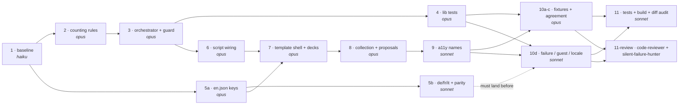

# Account Page — Deck, Collection & Proposal Stats with Links

**Type:** feature
**Status:** draft

## User Request

> "I also want on the same page too add stats from decks, collection and proposals as well as links to their respective pages."

Context: this follows the removal of the Trade history section from the Account page
(commit pending on `main`), which left a gap in the secondary column of `Account.vue`.

## Description

The Account page tells a user who they are but not what they have. Everything on it today is
identity and configuration — display name, location, trading range, phone verification, Discord
link, the communities they own and follow, their email. A user who wants to know how much of
the platform they are actually using, and who wants to get to it, has to leave and find three
separate pages on their own. There is no navigation from Account into any of them. It is a
dead end, and the removal of Trade history left a visible gap where a summary should be.

This feature adds a stats panel that answers "what do I have here, and where is it" in three
groups — decks, collection, and trade proposals — with each group linking to the page that owns
it. The proposal count carries most of the value: a user who came to change a setting leaves
knowing that two people are waiting on a trade answer, which is otherwise only discoverable by
opening the Trade Center. The deck and collection counts do the quieter work of making the
account feel worth returning to, and of turning three zeroes into three invitations for someone
who has just finished onboarding.

The panel is read-only and additive. It never writes, it never blocks the rest of the page from
rendering or saving, and each group loads, empties, and fails on its own so that one unavailable
source cannot blank the other two. Because the Account route has no authentication guard, a
signed-out visitor can reach this page, and must see a sign-in prompt rather than a spinner, a
zero, or anyone's data.

A number that disagrees with the page it links to is worse than no number, so each count is
defined against the same rule the destination page uses.

## Scope

**In scope:**
- A stats section on the Account page, in the secondary column where Trade history used to sit
- **Decks** — how many decks are saved to the account → links to the `decks` route
- **Collection** — two counts, cards in the trade pile and cards on the wishlist → links to the
  `library` route
- **Proposals** — two counts, proposals awaiting the user's answer and open trades → links to
  the `TradeCenter` route, `proposals` tab
- Per-group loading placeholder, empty state, and failure state
- A guest state for visitors with no session
- Accessible names on every stat link
- i18n keys for all four supported locales (en, de, fr, it)

**Out of scope:**
- Changing the Decks, Library, or Trade Center pages themselves
- New database tables, columns, RPCs, or Postgres functions
- Historical charts, trends, time-series, or "since your last visit" deltas
- Per-deck completion percentages on the Account page (those belong to the Decks page)
- Set-completion progress (covered by the separate `set-collection-progress` task)
- Achievements, badges, or gamification layered on these counts
- A completed-trades count (see Known Landmarks — an orphaned component has one; it is not
  part of this request)
- Re-adding trade history in any form
- Counting device-local guest decks; the panel is a signed-in surface

## Resolved Decisions

The draft's open questions are answered and folded into the criteria below.

1. **Which counts, and can they come from existing sources?** Yes, all of them, with no new
   Postgres functions. Deck count from the decks the user owns; the two collection counts from
   the user's live cards split by wishlist flag; the two proposal counts derived from the
   existing proposals feed the Trade Center already uses.
2. **Does the `dashboard` route overlap?** No. It renders only discovery and browse surfaces
   and shows no personal counts, so there is nothing to stay consistent with and nothing to
   reuse.
3. **One aggregate call or one per group?** Left to implementation, bounded by one requirement:
   the groups must fail independently (AC19), which rules out a single call whose failure
   blanks all three.

## User Scenarios

1. **Primary Flow — signed-in trader**: A trader opens the Account page. The stats section
   renders in the secondary column with three groups. Each shows a placeholder, then resolves
   independently: "3 decks", "42 in trade pile · 17 on wishlist", "2 waiting for your answer ·
   5 open". They click the proposals group and land on the Trade Center's proposals tab.

2. **Alternative Flow — new account**: Someone who has just finished onboarding sees every
   group at zero, each worded as an invitation — import your first deck, add cards to your
   collection, find a trade — and each still linking to its page.

3. **Alternative Flow — partly empty collection**: A user whose trade pile is empty but whose
   wishlist has 17 cards sees both numbers, rather than the whole group collapsing into a
   single empty state that hides the 17.

4. **Alternative Flow — guest**: A signed-out visitor reaches the Account page. The stats
   section shows a sign-in prompt. No counts appear and no personal data is requested.

5. **Error Handling**: The proposals source is unavailable. The proposals group says so, while
   decks and collection still show their numbers, and the profile form still saves normally. A
   group that could not load never renders as a zero.

## Acceptance Criteria

### Functional Requirements

- [ ] **AC1 — Panel renders for a signed-in user**: The three groups appear together.
  - Given: A signed-in user with at least one deck, one card, and one proposal
  - When: The Account page finishes loading
  - Then: The secondary column contains a stats section with exactly three groups — decks,
    collection, and proposals — each showing its counts

- [ ] **AC2 — Deck count**: Shows the number of decks saved to the account.
  - Given: A signed-in user with 3 decks saved to their account
  - When: The stats section loads
  - Then: The decks group shows 3

- [ ] **AC3 — Deck zero state**: A user with no decks is invited to make one.
  - Given: A signed-in user with 0 decks saved
  - When: The stats section loads
  - Then: The decks group shows an invitation to create or import a first deck, and that
    invitation links to the `decks` route

- [ ] **AC4 — Deck link destination**: The decks group leads to the decks page in the current
  locale.
  - Given: A signed-in user viewing the Account page at `/de/account`
  - When: They activate the decks group's link
  - Then: The router navigates to the route named `decks` with `params.locale` = `de`

- [ ] **AC5 — Collection counts**: Trade pile and wishlist are counted separately.
  - Given: A signed-in user whose live cards comprise 12 trade-pile entries and 5 wishlist
    entries
  - When: The stats section loads
  - Then: The collection group shows 12 for the trade pile and 5 for the wishlist

- [ ] **AC6 — Collection counting rule**: A card counts when it belongs to the user, carries
  the relevant wishlist flag, and has not been traded away.
  - Given: A signed-in user owns cards in both piles
  - When: The counts are produced
  - Then: Each count includes exactly the user's own cards with the matching wishlist flag,
    excluding any whose status is `traded`

- [ ] **AC7 — Locked cards count as held**: Cards committed to an in-flight trade still count.
  - Given: A signed-in user has a trade-pile card whose status is `locked`
  - When: The stats section loads
  - Then: That card is included in the trade-pile count, matching how the Library page treats it

- [ ] **AC8 — Traded cards excluded**: Cards already traded away do not count.
  - Given: A signed-in user has a card whose status is `traded`
  - When: The stats section loads
  - Then: That card is excluded from both collection counts

- [ ] **AC9 — Counts agree with the Library page**: The number does not contradict its
  destination.
  - Given: A signed-in account holding no stale zero-quantity, unlocked card entries
  - When: The user reads the collection counts and then opens the Library page
  - Then: The trade-pile count equals the number of cards the Library shows in the trade pile,
    and the wishlist count equals the number it shows across the wishlists
  - Note: A card entry whose quantity has fallen to zero without being locked is a known
    transient that the Library clears on its next load; it may briefly inflate this count and
    is not a defect of this feature

- [ ] **AC10 — Collection zero state**: An empty collection is an invitation.
  - Given: A signed-in user with 0 trade-pile cards and 0 wishlist cards
  - When: The stats section loads
  - Then: The collection group shows an invitation to add a first card, linking to the `library`
    route

- [ ] **AC11 — Partly empty collection**: One empty pile does not hide the other.
  - Given: A signed-in user with 0 trade-pile cards and 17 wishlist cards
  - When: The stats section loads
  - Then: The collection group shows 0 for the trade pile and 17 for the wishlist, rather than
    the group-level empty state

- [ ] **AC12 — Collection link destination**: The collection group leads to the library page in
  the current locale.
  - Given: A signed-in user viewing the Account page at `/fr/account`
  - When: They activate the collection group's link
  - Then: The router navigates to the route named `library` with `params.locale` = `fr`

- [ ] **AC13 — Proposal counts**: Awaiting-answer and open trades are counted separately.
  - Given: A signed-in user with 2 pending proposals they did not send, 3 pending proposals
    they did send, and 1 accepted trade
  - When: The stats section loads
  - Then: The proposals group shows 2 awaiting the user's answer and 6 open trades

- [ ] **AC14 — Awaiting-answer matches the Trade Center badge**: The two displays cannot drift.
  - Given: Any signed-in user with proposals in any mix of states
  - When: The awaiting-answer count is shown on Account and the proposals tab badge is shown in
    the Trade Center
  - Then: The two numbers are equal, both counting only pending proposals the user did not send

- [ ] **AC15 — Proposals zero state**: A user with no proposals is invited to trade.
  - Given: A signed-in user with no proposals at all
  - When: The stats section loads
  - Then: The proposals group shows an invitation to find a trade, linking to the `TradeCenter`
    route

- [ ] **AC16 — Proposals settled but not empty**: Finished trades are not mistaken for none.
  - Given: A signed-in user with 0 pending and 0 accepted proposals but 4 completed or
    cancelled ones
  - When: The stats section loads
  - Then: The proposals group shows 0 awaiting an answer and 0 open, and does not claim the
    user has never traded

- [ ] **AC17 — Proposals link destination**: The proposals group deep-links to the proposals
  tab.
  - Given: A signed-in user viewing the Account page at `/en/account`
  - When: They activate the proposals group's link
  - Then: The router navigates to the route named `TradeCenter` with `params.locale` = `en` and
    the tab parameter set to `proposals`, and the Trade Center opens on that tab

- [ ] **AC18 — Loading placeholder**: Each group shows a placeholder while its data is in
  flight.
  - Given: A signed-in user opens the Account page and the stat data has not yet resolved
  - When: The page has rendered
  - Then: Each unresolved group shows a loading placeholder, and the profile form is already
    visible and editable

- [ ] **AC19 — Failure is isolated to its own group**: One unavailable source does not blank
  the others.
  - Given: A signed-in user for whom exactly one of the three sources returns an error
  - When: The stats section resolves
  - Then: Only that group shows a failure message, and the other two groups show their counts

- [ ] **AC20 — Failure never renders as zero**: "Could not ask" is distinguishable from "none".
  - Given: A signed-in user whose deck source returns an error
  - When: The decks group resolves
  - Then: The group shows a failure message and does not show 0 or the empty-state invitation

- [ ] **AC21 — The page survives a total stats failure**: The rest of Account keeps working.
  - Given: A signed-in user for whom all three sources return errors
  - When: The stats section resolves
  - Then: All three groups show failure messages, and the profile form, communities list,
    following list and footer render normally and the profile still saves

- [ ] **AC22 — Guest sees a sign-in prompt**: No session means no numbers.
  - Given: A visitor with no session opens the Account page
  - When: The page loads
  - Then: The stats section shows a prompt to sign in, shows no counts and no loading
    placeholder, and does not settle into a permanent spinner

- [ ] **AC23 — Guest data isolation**: Nothing personal is requested without a session.
  - Given: A visitor with no session opens the Account page
  - When: The page loads and network activity is observed
  - Then: No request for decks, cards, or proposals is issued, and no count appears anywhere in
    the rendered page

- [ ] **AC24 — A stale load never overwrites a fresher one**: The panel only ever shows the
  current session's numbers.
  - Given: The session watch fires twice on one page load — once with no user id, then with the
    real id — or the user signs out or switches accounts while a stat request is still in flight
  - When: An earlier load's group resolves after a later load has started
  - Then: The earlier result is discarded rather than written, the panel settles on the most
    recent load's state, and no previous user's count is left on screen at any point

### Non-Functional Requirements

- [ ] **NFR1 — Session-gated**: No stat data is requested until a session identifier is
  available, and none is requested during pre-render.

- [ ] **NFR2 — Non-blocking**: The profile form, communities list, following list and footer
  render and stay interactive regardless of the state of any stat group; no stat query delays
  the page becoming usable.

- [ ] **NFR3 — Accessible links**: Each stat link exposes an accessible name identifying its
  destination, rather than a bare number.

- [ ] **NFR4 — Localised**: Every new string is present in `en`, `de`, `fr` and `it`, with the
  four key sets remaining identical, and reads correctly for counts of 0, 1 and many.

- [ ] **NFR5 — Clean console**: No new console errors or warnings are produced on the Account
  page for either a guest or a signed-in user.

### Definition of Done

**This section holds no criteria of its own.** The single authoritative Definition of Done is the
list at the very end of this file, after the Implementation Summary. It supersedes any earlier
draft copy; do not re-add a second list here, because two lists that drift apart is exactly the
defect this pointer exists to prevent.

## Known Landmarks

- Page: `frontend/src/components/Pages/App/Account.vue`
- Routes: `decks`, `library`, `TradeCenter` (`trade/:tab(matches|proposals|announces)?`)
- Data helpers: `frontend/src/lib/proposals.js` (`fetchMyProposals`), `frontend/src/lib/wishlists.js`,
  `frontend/src/lib/deckStats.js`
- Existing pile counter: `frontend/src/lib/onboarding.js` (`fetchPileCounts`) already counts
  both piles with the rule in AC6, and returns `null` rather than zero when the read fails —
  the in-repo precedent for AC20
- Trade Center's own pending badge is the reference for AC14
- i18n: `frontend/src/locales/{en,de,fr,it}.json` under the `account` namespace
- **Dead code warning**: `frontend/src/components/Pages/App/account/AccountProfileCard.vue` is
  an orphaned earlier attempt at Account stats — nothing imports it. It has "For trade /
  Wishlist / Completed" tiles with hardcoded English labels and no links, covering neither
  decks, nor proposals, nor the linking half of this request. Do not wire it up as a shortcut
  to this task; it should be cleaned up separately.

## Architecture Overview

### Solution Strategy

The panel is a read-only, client-side view over data the app already reads elsewhere. The whole
design question is therefore not "how do we get these numbers" — every one of them is already
computed somewhere — but "how do we get them without creating a second, drifting definition of
each one, and without letting any of them take the page down with them."

The approach is a **thin presentational section in `Account.vue` backed by one new pure-ish
library module, `frontend/src/lib/accountStats.js`**, that owns all three fetches and all three
derivations. `Account.vue` gains three state refs, one call in its existing session watch, and
one `<section>` of template using the CSS vocabulary already defined in the file. It gains no
query logic and no counting rules.

The decisive argument for a library module over inline logic is testability. This repo has 37
colocated `frontend/src/lib/*.js` + `*.test.js` pairs and **zero component tests** — a glob for
`frontend/src/components/**/*.test.js` returns no matches. Logic that lives in an SFC in this
codebase is, empirically, logic that is never asserted. AC13, AC14 and AC16 are precisely the
kind of requirement that rots silently: they say a filter expression here must keep agreeing
with a filter expression in `TradeCenter.vue`, and nothing but a test will notice the day it
stops. Putting the derivations in a module makes that test possible at the cost of one extra
file; inline code makes it impossible at the cost of nothing. The trade is lopsided.

Three alternatives were considered and rejected:

- **All logic inline in `Account.vue`** (what the analysis lists as the zero-new-files option).
  It is smaller and it is the path of least resistance for a panel this size. Rejected on the
  testability argument above, and because the proposals derivation is the one piece of this
  feature with a real correctness trap in it — `proposals.length` looks right and is wrong
  (AC16). That is the exact code that should be under test.
- **One aggregate fetch, or a new Postgres RPC returning all five numbers.** Cheapest at
  runtime, one round trip, one loading state. Rejected twice over: the task's scope forbids new
  RPCs, and Resolved Decision 3 plus AC19 forbid any single call whose failure blanks all three
  groups. The all-in-one shape is structurally incapable of per-group failure.
- **Extending `frontend/src/lib/onboarding.js` with the deck count and the orchestration.**
  Tempting because `fetchPileCounts()` already lives there. Rejected: `onboarding.js` is an
  app-wide shared module consumed by the OAuth callback and the sign-in dialog, and a deck count
  for an account panel is not an onboarding concern. Widening it to host unrelated stats makes
  a module three surfaces already depend on harder to reason about. We *call into* it; we do
  not grow it.

The cost accepted: one new file, one new import in `Account.vue`, and a small amount of
indirection between the template and the queries. The panel adds **four** concurrent network
requests to Account's mount from three independently-settling sources — `fetchPileCounts()`
(`onboarding.js:166-183`) is itself a `Promise.all` of two `head: true` reads, not one, so the
breakdown is three `head: true` count-only queries with near-zero payload (one `decks`, two
`"Card"`) plus one full-row `fetch_my_proposals` RPC. The RPC is the only request carrying a real
payload, and it is unavoidable: there is no head-count path to the proposal counts and the scope
forbids adding one (D2b). None of the four is on the critical path for the profile form (NFR2).

### Key Decisions

| # | Decision | Reasoning |
|---|---|---|
| **D1** | **One `<section>` containing three rows**, not three sibling sections. It becomes the **first child of `.acct-secondary`** (`Account.vue:366`), above "My communities" (`:369`) and "Communities I follow" (`:436`) — the slot Trade history vacated. | Three sections would put three `.acct-section-head` blocks in a column that already has two, reading as six headings of equal weight for what is one glance-level summary. One section with one heading and three `.acct-row`s matches the density of the communities lists it sits beside. Independence (AC19) is a state concern, not a markup concern: each row renders its own skeleton, error, empty and populated branch regardless of sharing a heading. Placement first is deliberate — the proposals count is the most actionable thing on the page ("two people are waiting on you") and should not sit below two community lists. `.acct-secondary` is `flex-direction: column; gap: 30px` (`:649`), so a third stacked section needs no layout change. |
| **D2a** | **Collection: reuse `fetchPileCounts(userId)` from `frontend/src/lib/onboarding.js:166-183` unmodified.** Import it into `accountStats.js`; write no new `"Card"` queries. | It already implements AC5–AC9 exactly: two `count:'exact', head:true` reads on `"Card"` filtered by `trader`, `wish`, `neq('status','traded')` — the same filter shape `Library.vue:369-372` uses, which is what makes AC9 hold. It already returns `null` rather than `0` when either read fails, which is the in-repo precedent for AC20. A second hand-rolled pair of queries would be two definitions of "collection size" that can drift apart on the next rule change. Do not edit the file. |
| **D2b** | **Proposals: reuse `fetchMyProposals()` from `frontend/src/lib/proposals.js:43-50`, and derive both counts client-side using the *same expressions* `TradeCenter.vue` uses.** Export them from `accountStats.js` as two named pure functions taking the proposals array. | There is no head-count path — the RPC returns full rows — and the scope forbids adding one. AC14 requires the awaiting-answer number to equal the Trade Center's tab badge; the only way to guarantee that rather than hope for it is to use the identical predicate, `p.status === "pending" && !p.i_am_proposer` (`TradeCenter.vue:222`). Open trades is the complement of `TradeCenter.vue:274`'s `history()`: `p.status === "pending" \|\| p.status === "accepted"` — this is what makes AC16 pass and what a bare `.length` gets wrong. Exporting them as pure functions is what makes both assertable without a browser. |
| **D2c** | **Decks: a new `fetchDeckCount(userId)` in `accountStats.js`** — `from('decks').select('id', { count: 'exact', head: true }).eq('user_id', userId)` — following `fetchPileCounts()`'s contract exactly: `null` on no user, `null` on error, a number on success. Not added to `onboarding.js`. | This is the one source with no existing helper. `DecksPage.vue:426-434` fetches full rows because it renders them; a count-only variant of the same scoping (`decks`, `user_id`) is the correct cheap read, and `count:'exact', head:true` is an established idiom here (`onboarding.js:170`, `community.js:139`). Mirroring `fetchPileCounts()`'s `null`-on-error shape rather than `0` is what satisfies AC20 for this group and keeps all three sources speaking one error language. It lives in the new module, not `onboarding.js`, per the Solution Strategy. |
| **D3** | **Orchestration lives in `frontend/src/lib/accountStats.js`, with `frontend/src/lib/accountStats.test.js` alongside it.** `Account.vue` holds only the three state refs, the watch call, and the template. | 37 lib test pairs, zero component tests — a module is the only place in this repo where this logic gets covered. The test locks the two proposal derivations against AC13's worked example (2 incoming pending + 3 outgoing pending + 1 accepted → 2 awaiting, 6 open) and against AC16 (4 completed/cancelled → 0 and 0), and asserts `fetchDeckCount` returns `null`, never `0`, on error. Follow `onboarding.test.js`'s style: assert the pure derivations directly, keep the network functions thin enough that their only untested content is the query builder chain. |
| **D4** | **Failure isolation: three independently started promises, each wrapped in its own `try`/`catch` inside `accountStats.js`, each resolving to its own group object that `Account.vue` writes to its own ref.** No `Promise.all` across the three groups. Each group's ref holds a **tri-state object `{ status, data }`** with `status` in `guest \| loading \| ready \| error` — `loading` is the ref's initial value, the other three come from the module (see the orchestrator contract under Expected Changes). | A bare `Promise.all` — the shape `loadCommunities()` uses at `Account.vue:182-186` — rejects the whole batch on one rejection and would blank all three groups, contradicting AC19 and AC21. Starting three promises independently keeps the concurrency without the fail-fast aggregation. The tri-state makes AC20 structurally impossible to violate: the template branches `guest → loading → error → empty → populated` in that order, so an `error` status has no path to rendering `0` or the empty-state invitation, and the number itself is only reachable inside the `ready` branch. `fetchMyProposals()` **throws** on error (unlike `fetchPileCounts()`, which returns `null`) — that asymmetry is handled once, in `accountStats.js`, so `Account.vue` sees one uniform contract. The guest branch of the existing watch (`Account.vue:221-228`) sets all three to `guest` and fires nothing, satisfying AC22, AC23 and NFR1; every loader still settles its flag in the no-user branch so no skeleton can hang. |
| **D5** | **Consistency with destinations is enforced by sharing the expression, not by matching the value.** Each count is defined by the same predicate its destination page uses, and the two proposal predicates are exported so a test pins them. | "The number agrees with the page" is not a property you can check once — it is a property that has to survive the next change to either side. Collection inherits Library's rule through `fetchPileCounts()`; proposals inherit TradeCenter's through the identical filter expressions; decks inherits DecksPage's through the same `user_id` scoping. If a later change makes them disagree, `accountStats.test.js` is where it surfaces. A worthwhile follow-up, out of scope here: have `TradeCenter.vue` import `awaitingAnswerCount()` from this module so the shared predicate becomes a single literal definition rather than two copies of one. |
| **D7** | **Stale-result guard: a generation counter owned by `accountStats.js` (`createStatsGeneration()`), captured once per `loadStats()` call and re-checked inside every `.then()` before a ref is written. `loadStats()` also resets all three refs synchronously at its start.** | The session watch at `Account.vue:221-228` runs with `{ immediate: true }` and therefore fires twice on a normal signed-in load — once with `id` undefined, then with the real id — so two `loadAccountStats()` runs overlap and a slow group from the first can resolve after the second. "The guest promises resolve first, so ordering is safe in practice" is an accident of microtask timing, not a guarantee, and it stops holding entirely on a real sign-out or account switch, where a slow read started by the previous user can land after the new state and repaint their numbers. The counter makes correctness structural instead of incidental: each call takes `gen.next()`, each resolution writes only `if (gen.isCurrent(token))`, so any result from a superseded load is dropped. The synchronous reset is the other half of it — without it, the previous account's numbers stay painted until the new ones arrive, which AC24 forbids. The counter lives in the module rather than in the SFC because the module is the only place in this repo that has tests (D3), which is what turns AC24 from a manual observation into an assertion (Step 4). |
| **D6** | **Template reuses `Account.vue`'s existing scoped classes** — `.acct-section-head`, `.acct-h2`, `.acct-rows`, `.acct-row`, `.acct-row--sk`, `.acct-empty`, `.acct-linkbtn` (defined `:610-679`). No new CSS. Every link carries `params: { locale }` from the existing `locale` computed (`:231`). Any Tailwind `p-*`/`m-*`/`.5`-step class added needs the `!` prefix. | The communities and following sections are already two independently loading stat-like lists sharing one visual vocabulary; a third that invents classes would look adjacent-but-off. The locale param is mandatory for AC4, AC12 and AC17 — a `router-link` without it resolves to the wrong locale prefix. The `!` prefix is the documented Vuetify-reset trap in this app: unprefixed spacing utilities compute to `0px` and the element visibly collapses. |

### Expected Changes

**CREATE**

- `frontend/src/lib/accountStats.js` — exports `fetchDeckCount(userId)`, `awaitingAnswerCount(proposals)`, `openTradesCount(proposals)`, the stale-result guard `createStatsGeneration()`, and the orchestrator `loadAccountStats(userId)`. Imports `fetchPileCounts` from `./onboarding.js` and `fetchMyProposals` from `./proposals.js`; wraps the latter's throw into the same non-throwing contract as the other two.

  **Orchestrator contract (committed — this is the surface `accountStats.test.js` targets):**

  ```js
  /**
   * @typedef {Object} StatGroup
   * @property {'guest'|'ready'|'error'} status
   * @property {Object|null} data          // null unless status === 'ready'
   *
   * @param {string|null|undefined} userId
   * @returns {{
   *   decks:      Promise<{ status, data: { count: number } | null }>,
   *   collection: Promise<{ status, data: { tradeCount: number, wishCount: number } | null }>,
   *   proposals:  Promise<{ status, data: { awaiting: number, open: number } | null }>,
   * }}
   */
  export function loadAccountStats(userId) { /* ... */ }
  ```

  - **Synchronous, returns a map of three promises.** Not `async`; it starts the three sources and hands back one promise per group, so the caller attaches three independent `.then()`s and each group leaves its loading state the moment *its own* source settles (AC18, AC19). This is what a single `await`ed aggregate — or a `Promise.all` — structurally cannot do.
  - **No promise in the map ever rejects, and the function never throws synchronously.** `fetchMyProposals()`'s throw (`proposals.js:44-48`) is caught inside this module and converted to `{ status: 'error', data: null }`; `fetchPileCounts()`'s and `fetchDeckCount()`'s `null` return is converted to the same. `Account.vue` therefore needs no `try`/`catch` and no `.catch()` — one uniform contract for all three groups (D4).
  - **`status` is only ever `guest`, `ready` or `error`.** `loading` is the component's *initial ref value*, never something this module emits; a group is loading exactly while its promise is unsettled.
  - **`data` is `null` for `guest` and `error`, and a plain object for `ready`** — so a failed group has no numeric field to accidentally render, which is what makes AC20 structurally unreachable rather than merely avoided.
  - **A falsy `userId` fires zero network requests** and resolves all three to `{ status: 'guest', data: null }` (AC22, AC23, NFR1). The `guest` status is returned rather than left pending precisely so no skeleton can hang.
    - **`createStatsGeneration()` is a separate, pure export, not something baked into the orchestrator.** It returns `{ next(), isCurrent(token) }` over a private incrementing counter: `next()` claims a generation and returns its token, `isCurrent(token)` says whether that token is still the newest. The orchestrator stays stateless and therefore stays trivially testable; the generation object is created once per component instance and threaded through every `.then()` by the caller (D7, AC24). Keeping it out of `loadAccountStats` also means a caller that legitimately wants two concurrent loads is not silently prevented from having them.
  - **Why this shape over the alternatives.** A handlers/callback signature (`loadAccountStats(userId, handlers)`) achieves the same isolation but makes the test assert callback invocation order and timing instead of values. Three separately exported loaders push the isolation logic back into `Account.vue` — the one file in this repo that has no test (D3), which defeats the entire reason for the module. The promise map keeps isolation inside the tested module and keeps every assertion a plain `await expect(...)`.
- `frontend/src/lib/accountStats.test.js` — covers AC13, AC14, AC16 via the two exported proposal derivations, and the `null`-not-zero error contract of `fetchDeckCount`.

**MODIFY**

- `frontend/src/components/Pages/App/Account.vue` — three tri-state refs; one module-level `createStatsGeneration()` instance guarding every write to them (D7, AC24); a `loadStats()` call added to the existing `watch(() => props.login?.user?.id, ...)` at `:221-228` (with the else-branch setting all three to the guest state and firing nothing); one new `<section aria-labelledby="acct-stats-h">` as the first child of `.acct-secondary` at `:366`, reusing the existing classes and the existing `locale` computed at `:231`. Additive only — no existing ref, computed or section is touched.
- `frontend/src/locales/en.json`, `de.json`, `fr.json`, `it.json` — new keys under the `account` namespace: section heading, five count labels, three empty-state CTAs, per-group failure text, the guest sign-in prompt, and three accessible link names (NFR3). Counts use `vue-i18n` pluralization (pipe syntax) so 0/1/many read correctly (NFR4). All four files edited together; key sets must stay identical.

**NOT changed** (verified, listed to prevent well-meaning drift)

- `frontend/src/lib/onboarding.js` — called, not edited.
- `frontend/src/lib/proposals.js`, `frontend/src/components/Pages/App/TradeCenter.vue`, `Library.vue`, `DecksPage.vue`, `frontend/src/router/index.js`, `frontend/vite.config.js` — no changes; the panel only adds new call sites and new `router-link`s to existing named routes.
- `frontend/src/components/Pages/App/account/AccountProfileCard.vue` — orphaned dead code, explicitly out of scope. Do not wire it up.

### References

- Skill: `.claude/skills/account-stat-panels/SKILL.md` — count-query patterns, the `.acct-rows` layout/skeleton/empty vocabulary, route and i18n conventions, SSG safety, and the Tailwind/Vuetify `!` prefix trap.
- Analysis: `.specs/analysis/analysis-account-stats-panel.md` — file-by-file integration points, the corrected proposal derivations with line references, and the risk table (notably the `Promise.all` risk that D4 resolves).

## Skill Reference

Read `.claude/skills/account-stat-panels/SKILL.md` before implementing — it covers
count-query patterns (with reusable examples), the `.acct-rows` layout/skeleton/empty
conventions, route/i18n conventions, SSG safety, and the Tailwind/Vuetify `!` prefix trap.

## Implementation Process

Eleven steps in four phases, **not eleven steps in sequence** — see the Implementation Summary,
the wave diagram and the Sub-Agent Execution Directive at the end of this section before starting
anything. Every step carries its own `Depends on:` / `Parallel with:` / `Agent:` header; those
annotations, not the step numbers, define the order. Every component in Expected Changes maps to at
least one step:
`accountStats.js` → Steps 2–3, `accountStats.test.js` → Step 4, the four locale files → Step 5,
`Account.vue` script → Step 6, `Account.vue` template → Steps 7–9.

All commands run from `frontend/`. Tests are Vitest (`npm run test` = `vitest run`), colocated as
`src/lib/<name>.test.js`. `npm run build` runs sitemap generation, the OTS data sync, `vite-ssg
build`, sitemap pruning and `verify-ssg-output.mjs` — it must stay green. Any Tailwind `p-*`/`m-*`
/`.5`-step/arbitrary-value class needs a `!` prefix or it silently computes to `0px` under
Vuetify's unlayered reset.

---

### Phase 1 — Setup

#### Step 1 — Establish a green baseline and confirm the anchors

**Depends on:** nothing — this is the gate for every other step.
**Parallel with:** nothing. Step 1 runs alone; every later step's line anchors and green-baseline
assumption come from it.
**Agent:** `haiku` — mechanical: five greps and two commands. A red baseline or a moved anchor
still has to be reported rather than worked around, which is a reporting rule, not a reasoning load.

**Goal:** Prove the tree is green before anything is added, and confirm the line anchors this plan
edits against still point where the Architecture Overview says they do.

**Output:** No file changes. A recorded baseline (test count, build result, confirmed anchors) in
the working branch's notes.

**Subtasks:**
1. Run `npm run test` in `frontend/` and record the passing suite count (37 lib suites today).
2. Run `npm run build` in `frontend/` and confirm sitemap generation, `vite-ssg build`, sitemap
   pruning and `verify-ssg-output.mjs` all pass.
3. `grep -n 'acct-secondary\|const locale = computed' frontend/src/components/Pages/App/Account.vue`
   — confirm `.acct-secondary` at `:366` and the `locale` computed at `:231`; read the session
   `watch(() => props.login?.user?.id, ...)` at `:221-228`.
4. Confirm `/account` is still absent from `includedRoutes()` in `frontend/vite.config.js:78-115`
   (the prerender half of NFR1).
5. Read `frontend/src/lib/near.test.js:1-14` and `frontend/src/lib/edgeFunction.test.js:1-7` for
   the `vi.mock("@/lib/supabaseClient", ...)` + top-level `await import("./x")` pattern that Step 4
   copies.

**Success Criteria:**
- `npm run test` exits 0 and `npm run build` exits 0 on the unmodified branch.
- `.acct-secondary` (`Account.vue:366`), `locale` (`:231`) and the session watch (`:221-228`) are
  confirmed at those lines, or every line reference in this plan is updated to the real ones.
- `/account` confirmed absent from `frontend/vite.config.js` `includedRoutes()` (NFR1).

**Estimate:** Small

**Blockers:** None.

**Risks:**
- *Baseline is already red on `main`.* → Stop. Fix or branch from a green commit first; a
  pre-existing failure carried into this diff makes Step 11 unreadable.

**Verification:**
- **Level: None.** Every success criterion here is already a machine check — `npm run test` exits 0,
  `npm run build` exits 0, and three greps either match at the stated lines or they do not. An LLM
  judge would be re-reading exit codes and adding a round trip for nothing. The only judgement in
  the step (stop if the baseline is red) is a stop rule, not an artifact to grade.

---

### Phase 2 — Foundational

#### Step 2 — `accountStats.js`: the three counting rules

**Depends on:** Step 1 (needs the confirmed `TradeCenter.vue:222` / `:271-274` anchors to copy the
predicates from).
**Parallel with:** Step 5 — different files entirely (`src/lib/accountStats.js` vs
`src/locales/*.json`), no shared symbol, neither reads the other's output.
**Agent:** `opus` — three small functions, but two of them are the correctness traps the whole
feature turns on (AC14, AC16); `proposals.length` looks right and is wrong.

**Goal:** Land the counting rules as importable, individually testable functions, with no
orchestration and no component wiring yet.

**Output:** `frontend/src/lib/accountStats.js` (new), exporting `awaitingAnswerCount(proposals)`,
`openTradesCount(proposals)` and `fetchDeckCount(userId)`.

**Subtasks:**
1. Create the file with a module docstring in `onboarding.js:160-174`'s voice, stating explicitly
   that `null` means "could not ask" and is never `0`.
2. `export function awaitingAnswerCount(proposals)` →
   `(proposals ?? []).filter(p => p.status === "pending" && !p.i_am_proposer).length`. Copy the
   predicate from `TradeCenter.vue:222` rather than retyping it — AC14 depends on the two
   expressions being identical, not merely equivalent.
3. `export function openTradesCount(proposals)` →
   `(proposals ?? []).filter(p => p.status === "pending" || p.status === "accepted").length`, the
   complement of `TradeCenter.vue:274`'s `history()` (AC13, AC16).
4. `export async function fetchDeckCount(userId)` — `if (!userId) return null;` then
   `getClient().from('decks').select('id', { count: 'exact', head: true }).eq('user_id', userId)`;
   on `error`, `console.error` and `return null`; otherwise `return count ?? 0`. Import `getClient`
   from `@/lib/supabaseClient`. The contract mirrors `fetchPileCounts()` exactly (D2c, AC20).
5. Write no new `"Card"` query and make no edit to `frontend/src/lib/onboarding.js` (D2a).

**Success Criteria:**
- `frontend/src/lib/accountStats.js` exports exactly `awaitingAnswerCount`, `openTradesCount` and
  `fetchDeckCount` at the end of this step.
- The `awaitingAnswerCount` predicate is character-for-character the one at `TradeCenter.vue:222`
  (AC14).
- `fetchDeckCount` returns `null` — never `0` — for a falsy `userId` and for a Supabase error
  (AC20); it returns `0` only when the query succeeds with `count: 0`.
- `git diff --stat` shows `frontend/src/lib/onboarding.js` and `frontend/src/lib/proposals.js`
  unchanged.

**Estimate:** Small

**Blockers:** None. `decks` / `user_id` scoping and owner-read RLS are already proven by the live
query at `DecksPage.vue:426-434`.

**Risks:**
- *A subtly different proposal predicate (`!== "declined"`, `.length`, etc.) silently breaks AC14
  or AC16.* → Copy-paste from `TradeCenter.vue:222,271-274`; Step 4's AC13/AC16 tests are the
  backstop.

**Verification:**
- **Level: Panel** (3 independent judges) — HIGH criticality. `awaitingAnswerCount` and
  `openTradesCount` are the two expressions AC14 and AC16 exist to protect, and both are the kind of
  "looks right, is wrong" code (`proposals.length`) that a single reviewer skims past. Nothing here
  is machine-checkable yet: the tests that would catch a wrong predicate are not written until Step 4.
- **Judges:** `opus`, `pr-review-toolkit:code-reviewer`, `pr-review-toolkit:silent-failure-hunter`.
- **Rubric** (weights sum to 1.0):
  - **Predicate fidelity to the destination pages** (0.35) — is `awaitingAnswerCount` the same
    expression as `TradeCenter.vue:222`, and is `openTradesCount` the exact complement of
    `history()` at `:271-274`? *1:* an invented predicate (`!== "declined"`, `.length`). *3:*
    logically equivalent but retyped, reordered or re-worded, so the two copies can drift.
    *5:* character-for-character the source expression, with the source line cited in a comment.
  - **`null`-not-zero contract of `fetchDeckCount`** (0.25) — *1:* returns `0` on error. *3:*
    returns `null` for one of {falsy `userId`, query error} and `0` for the other. *5:* `null` for
    both, `0` only from a successful `count: 0`, mirroring `fetchPileCounts()` exactly (AC20).
  - **Blast radius** (0.20) — *1:* `onboarding.js` or `proposals.js` edited, or a second hand-rolled
    `"Card"` query added. *3:* no forbidden edit, but orchestration or component concerns have
    already leaked into the file ahead of Step 3. *5:* three exports and a docstring, nothing else.
  - **Nullish-input handling** (0.10) — *1:* throws on `null`/`undefined` proposals. *3:* handles
    `null` but not `undefined` (or guards with a truthiness test that also swallows `0`). *5:*
    `(proposals ?? [])` on both derivations.
  - **Docstring states the error language** (0.10) — *1:* no docstring. *3:* present but silent on
    what `null` means. *5:* says explicitly that `null` means "could not ask" and is never `0`, in
    `onboarding.js:160-174`'s voice.
- **Threshold:** 4.5 / 5.0 — higher than the default because a 4.0 here means "one predicate is
  merely equivalent rather than identical", which is precisely the AC14 drift the module exists to
  prevent. Any judge scoring the fidelity criterion below 5 sends the step back.
- **What to feed the judge:** `frontend/src/lib/accountStats.js` (the new file);
  `frontend/src/components/Pages/App/TradeCenter.vue` lines 215-280 (the source predicates);
  `frontend/src/lib/onboarding.js:160-183` (the contract being mirrored); AC13, AC14, AC16, AC20 of
  this file.

#### Step 3 — `loadAccountStats(userId)`: the orchestrator

**Depends on:** Step 2 — it calls `fetchDeckCount`, `awaitingAnswerCount` and `openTradesCount`
directly, so those exports must exist first. Same file, so this is also a write conflict, not only
a data dependency.
**Parallel with:** Step 5.
**Agent:** `opus` — the never-rejecting, non-`async`, per-group-promise contract plus the
generation guard is the design-heavy core of the task; getting it `async` or `Promise.all`-shaped
silently breaks AC19/AC21.

**Goal:** Expose the committed orchestrator contract from Expected Changes — a synchronous
function returning three never-rejecting promises, one per group.

**Output:** `frontend/src/lib/accountStats.js`, `loadAccountStats` added.

**Subtasks:**
1. Import `fetchPileCounts` from `./onboarding.js` and `fetchMyProposals` from `./proposals.js`.
2. Add module-private helpers `const guest = () => ({ status: "guest", data: null })` and
   `const failed = () => ({ status: "error", data: null })`.
3. `export function loadAccountStats(userId)` — **not** `async`. When `userId` is falsy, return
   `{ decks: Promise.resolve(guest()), collection: Promise.resolve(guest()), proposals:
   Promise.resolve(guest()) }` before touching any data source (AC22, AC23, NFR1).
4. Otherwise start three independent async loaders immediately:
   - decks — `const n = await fetchDeckCount(userId);` → `n === null ? failed() : { status: "ready",
     data: { count: n } }`.
   - collection — `const c = await fetchPileCounts(userId);` → `c === null ? failed() : { status:
     "ready", data: { tradeCount: c.tradeCount, wishCount: c.wishCount } }`.
   - proposals — `try { const rows = await fetchMyProposals(); return { status: "ready", data: {
     awaiting: awaitingAnswerCount(rows), open: openTradesCount(rows) } }; } catch { return
     failed(); }`. This single `catch` is the one place `fetchMyProposals()`'s throw is reconciled
     with the other two sources' `null` (D4).
5. Return the map of the three promises directly. Do not `await`, `Promise.all` or
   `Promise.allSettled` across the three groups before returning — that is the exact shape AC19 and
   AC21 rule out.
6. Copy the contract docblock from the Architecture Overview's Expected Changes verbatim above the
   function, so the guarantees live next to the code that must keep them.
7. Add the stale-result guard as its own pure export (D7, AC24):
   `export function createStatsGeneration() { let current = 0; return { next: () => ++current,
   isCurrent: (token) => token === current }; }`. It holds no data and does no I/O — it exists so a
   caller can claim a generation before starting a load and check, at every resolution, whether that
   load is still the newest. Document on it, in one line, *why* it exists: the session watch fires
   twice with `{ immediate: true }`, so two loads overlap on every signed-in page load, and a
   sign-out or account switch can leave a previous user's read in flight.

**Success Criteria:**
- `createStatsGeneration()` returns an independent counter per call: two instances do not
  interfere, `next()` returns a strictly increasing token, and `isCurrent(t)` is true only for the
  most recently issued token of that instance (AC24).
- `loadAccountStats(null)` returns synchronously, calls `getClient` zero times, and its three
  promises resolve to `{ status: "guest", data: null }` (AC22, AC23, NFR1).
- No promise returned by `loadAccountStats` ever rejects, including when all three sources fail
  (AC21).
- A group whose source failed resolves with `status: "error"` and `data: null`, so no numeric field
  exists to render (AC20).
- `grep -n "Promise.all" frontend/src/lib/accountStats.js` returns nothing (AC19).
- `grep -n "async function loadAccountStats" frontend/src/lib/accountStats.js` returns nothing —
  the orchestrator is synchronous.

**Estimate:** Medium

**Blockers:**
- *`fetchMyProposals()` throws while `fetchPileCounts()` and `fetchDeckCount()` return `null`.*
  Resolved by design: the asymmetry is absorbed inside this function (subtask 4), so `Account.vue`
  sees one contract and needs no `try`/`catch`.

**Risks:**
- *Making `loadAccountStats` `async` reintroduces a single await point and one shared failure
  surface.* → Step 4 asserts the return value is a plain object with three thenables, checked
  synchronously before any `await`.
- *A future edit adds `Promise.all` for "tidiness" and silently breaks AC19.* → Leave a one-line
  comment at the return site naming AC19, matching the house style of explaining the constraint
  rather than only the code.

**Verification:**
- **Level: Panel** (3 independent judges) — HIGH criticality, the highest in the plan. The
  orchestrator's guarantees are all *negative* ones — never `async`, never `Promise.all`, never
  rejects, never emits `loading` — and negative guarantees are what reviewers miss. AC19, AC21 and
  AC24 all fail silently and invisibly if this shape is wrong, and Step 4's tests are written
  against this contract, so a wrong contract produces green tests over broken behaviour.
- **Judges:** `opus`, `pr-review-toolkit:silent-failure-hunter`, `pr-review-toolkit:code-reviewer`.
- **Rubric** (weights sum to 1.0):
  - **Promise-map shape** (0.25) — *1:* `async function`, or a single awaited aggregate. *3:*
    synchronous but the three loaders are combined with `Promise.allSettled` before returning, so a
    group cannot settle on its own. *5:* synchronous, returns `{ decks, collection, proposals }` as
    three already-started, independently settling promises (AC18, AC19).
  - **Uniform never-rejecting error contract** (0.25) — *1:* `fetchMyProposals()`'s throw escapes to
    the caller. *3:* caught, but a failed group still carries a numeric field, or `null` returns are
    converted inconsistently between the three sources. *5:* every failure path lands on
    `{ status: "error", data: null }`, so a failed group has no number to render (AC20, AC21).
  - **`createStatsGeneration` purity and independence** (0.25) — *1:* baked into `loadAccountStats`
    or backed by module-level shared state. *3:* a separate export, but `isCurrent` accepts a stale
    token (e.g. `>=` instead of `===`) or the counter is shared across instances. *5:* an
    independent closure per call, strictly increasing tokens, `isCurrent` true only for the newest,
    with a one-line comment naming the `{ immediate: true }` double-fire and the sign-out race (D7).
  - **Guest short-circuit precedes all I/O** (0.15) — *1:* a falsy `userId` still reaches a query.
    *3:* returns guest, but only after constructing a client or after starting one loader. *5:*
    returns three resolved `guest` promises before touching any source, so zero requests are issued
    and no group is left pending (AC22, AC23, NFR1).
  - **Contract documented next to the code** (0.10) — *1:* no docblock. *3:* a docblock that
    paraphrases and omits a guarantee. *5:* the Expected Changes docblock verbatim, plus the
    one-line AC19 comment at the return site warning off a future `Promise.all`.
- **Threshold:** 4.5 / 5.0 — this is the generation-token and failure-isolation step; a 4.0 average
  can hide a single criterion at 3, and each of these criteria at 3 is a shipped AC violation.
- **What to feed the judge:** `frontend/src/lib/accountStats.js`; the committed orchestrator
  contract in this file's Expected Changes section; `frontend/src/lib/onboarding.js:166-183`;
  `frontend/src/lib/proposals.js:43-50`; D4, D7, AC19-AC24.

#### Step 4 — `accountStats.test.js`

**Depends on:** Step 3 (asserts `loadAccountStats` and `createStatsGeneration`; the derivation
tests only need Step 2, so a splitter may start those the moment Step 2 lands).
**Parallel with:** Step 5 **and** Step 6 — this is the widest point of the plan. Step 4 writes only
`src/lib/accountStats.test.js`, Step 6 writes only `Account.vue`'s script block, Step 5 writes only
the locale JSON. Three agents, three disjoint file sets, no ordering between them.
**Agent:** `opus` — a wrong Supabase-builder stub produces confident false greens on exactly the
criteria the module exists to protect; this is the step where being subtly wrong is most expensive.

**Goal:** Lock the derivations and the failure-isolation contract so AC13, AC14, AC16 and AC19–AC24
cannot regress silently — the entire justification for the module existing (D3).

**Output:** `frontend/src/lib/accountStats.test.js` (new).

**Subtasks:**
1. Set up mocks following `near.test.js:1-4` / `edgeFunction.test.js:1-7`: `vi.mock("@/lib/
   supabaseClient", () => ({ getClient: () => ({ from, rpc }) }))` with a chainable builder stub
   whose `.select/.eq/.neq` return `this` and which resolves to `{ count, error }`, then
   `const { ... } = await import("./accountStats")`. Mock at the `supabaseClient` level rather than
   `vi.mock("./onboarding")` so the real `fetchPileCounts` filter chain (AC6) stays exercised.
2. Derivation tests: AC13's worked example (2 incoming pending + 3 outgoing pending + 1 accepted →
   `awaiting: 2`, `open: 6`); AC16 (4 completed/cancelled/declined and nothing else → `0` and `0`,
   with an explicit assertion that the answer is not `proposals.length`); AC14 (an outgoing pending
   proposal is excluded from `awaitingAnswerCount`); `[]`, `null` and `undefined` → `0`.
3. `fetchDeckCount` tests: falsy `userId` → `null` with zero queries; `{ error }` → `null`, asserted
   with `toBeNull()` and `not.toBe(0)` (AC20); `{ count: 0, error: null }` → `0`.
4. Orchestrator tests: `loadAccountStats(null)` → three `guest` groups and zero `from`/`rpc` calls
   (AC22, AC23); decks errors while the other two succeed → `decks.status === "error"` and the
   other two `"ready"` with their numbers (AC19); all three fail → three `"error"` groups and no
   rejection (AC21); the proposals RPC rejects → `proposals.status === "error"` with no unhandled
   rejection.
5. `createStatsGeneration` tests (AC24, the stale-result guard): `next()` returns strictly
   increasing tokens; `isCurrent(t)` is true for the newest token and false for every earlier one;
   two independent instances do not affect each other. Then the scenario test that actually pins
   the race — drive it without a browser: claim token A, claim token B, resolve A last, and assert
   that a writer written as `if (gen.isCurrent(tokenA)) sink = value` leaves `sink` untouched while
   the token-B write lands. Name the test after the real sequence it stands for ("a load started
   before sign-out does not overwrite the load started after it").
6. Run `npx vitest run src/lib/accountStats.test.js` until green, then `npm run test` for the
   whole suite.

**Success Criteria:**
- `npx vitest run src/lib/accountStats.test.js` is green with no network access.
- Each of AC13, AC14, AC16, AC19, AC20, AC21, AC22, AC23 and AC24 is covered by at least one test
  whose name states the criterion in plain language.
- AC24 is covered by assertion, not by manual observation: the out-of-order resolution scenario in
  subtask 5 fails if `isCurrent` is removed or inverted.
- Deliberately breaking `openTradesCount` to `proposals.length` makes the AC16 test fail (verify
  once, then revert) — the test actually pins the trap D2b names.
- `npm run test` shows 38 lib suites passing.

**Estimate:** Medium

**Blockers:**
- *`fetchPileCounts` lives in another module and cannot be stubbed per-call without hiding AC6's
  filter chain.* Resolution: mock `@/lib/supabaseClient` once and route both `decks` and `"Card"`
  reads through the same `from` stub, branching the resolved value on the table name.

**Risks:**
- *Getting the chainable Supabase builder stub wrong produces false greens.* → Make the stub
  thenable and assert on the recorded `.eq`/`.neq` arguments in at least one collection test, so a
  stub that silently swallows the filters fails loudly.

**Verification:**

Step 4 is verified at the granularity of its three-way split (High-Risk Tasks item 2), because the
three pieces fail in different ways and only one of them is worth a panel.

- **4a — the pure derivation tests**
  - **Level: Single** (one judge) — MEDIUM. The artifact is small, self-contained and needs no
    mock; the thing to check is whether the assertions actually encode the worked examples in the
    ACs, which one careful reader can establish.
  - **Judge:** `pr-review-toolkit:pr-test-analyzer`.
  - **Rubric** (sums to 1.0):
    - **AC13's worked example is encoded exactly** (0.30) — *1:* no fixture resembling it. *3:* the
      right totals from a fixture that does not distinguish incoming from outgoing pending. *5:* 2
      incoming pending + 3 outgoing pending + 1 accepted asserted as `awaiting: 2`, `open: 6`.
    - **AC16 is pinned against the `.length` trap** (0.30) — *1:* absent. *3:* asserts `0`/`0` for a
      settled-only fixture. *5:* also asserts explicitly that the answer differs from
      `proposals.length`, so the trap is named in the test, not just avoided.
    - **AC14's exclusion is asserted** (0.20) — *1:* absent. *3:* implied by the AC13 fixture only.
      *5:* a dedicated case proving an outgoing pending proposal is excluded from
      `awaitingAnswerCount`.
    - **Nullish and empty inputs** (0.10) — *1:* untested. *3:* `[]` only. *5:* `[]`, `null` and
      `undefined` all asserted to yield `0`.
    - **Test names state the criterion in plain language** (0.10) — *1:* `"works"`. *3:* names the
      function. *5:* names the behaviour and the AC it stands for.
  - **Threshold:** 4.0 / 5.0.
  - **What to feed the judge:** `frontend/src/lib/accountStats.test.js` (derivation block);
    `frontend/src/lib/accountStats.js`; AC13, AC14, AC16 of this file.

- **4b — the mock harness and `fetchDeckCount` tests**
  - **Level: Single** (one judge) — MEDIUM, but graded strictly. A stub that silently swallows
    `.eq`/`.neq` produces confident false greens on AC6; that is a property one judge can check
    directly by reading the stub against the real filter chain, so a panel adds cost without adding
    signal.
  - **Judge:** `opus`.
  - **Rubric** (sums to 1.0):
    - **Stub fidelity** (0.30) — *1:* returns a bare object, so the builder chain throws or is
      bypassed. *3:* chainable and thenable but returns one fixed payload for every table. *5:*
      chainable, thenable, and branches its resolved value on the table name so `decks` and `"Card"`
      reads can differ in one test run.
    - **The stub cannot swallow filters undetected** (0.30) — *1:* no assertion on recorded calls.
      *3:* asserts `.eq` was called. *5:* asserts the recorded `.eq`/`.neq` arguments for at least
      one collection read, so a stub that drops `neq('status','traded')` fails loudly (AC6).
    - **`fetchDeckCount` cases** (0.25) — *1:* happy path only. *3:* error case asserted with a
      truthiness check that would also pass for `0`. *5:* falsy `userId` → `null` with zero queries;
      `{ error }` → `toBeNull()` *and* `not.toBe(0)`; `{ count: 0 }` → `0` (AC20).
    - **No real client, no network** (0.15) — *1:* the real `supabaseClient` is reachable. *3:*
      mocked, but via `vi.mock("./onboarding")`, which hides AC6's filter chain. *5:* mocked at
      `@/lib/supabaseClient` per `near.test.js` / `edgeFunction.test.js`, keeping the real
      `fetchPileCounts` under test.
  - **Threshold:** 4.5 / 5.0 — a false green here is worse than no test, because it is a test that
    is *cited* as covering AC6.
  - **What to feed the judge:** `frontend/src/lib/accountStats.test.js`;
    `frontend/src/lib/near.test.js:1-14`; `frontend/src/lib/edgeFunction.test.js:1-7`;
    `frontend/src/lib/onboarding.js:166-183`.

- **4c — orchestrator isolation and the generation-guard scenario**
  - **Level: Panel** (3 independent judges) — HIGH. This is the only place AC24 is proved rather
    than observed, and a race test that passes whether or not the guard exists is the classic
    failure mode. Independent readers are worth it because "does this test still fail if I delete
    the guard?" is a question judges answer differently.
  - **Judges:** `opus`, `pr-review-toolkit:pr-test-analyzer`,
    `pr-review-toolkit:silent-failure-hunter`.
  - **Rubric** (sums to 1.0):
    - **The race scenario actually pins the guard** (0.35) — *1:* only `next()`/`isCurrent()` unit
      behaviour is tested, no out-of-order resolution. *3:* an out-of-order scenario that would
      still pass with `isCurrent` always returning true. *5:* token A claimed, token B claimed, A
      resolved last, asserting the A-write is dropped and the B-write stands — and it demonstrably
      fails if `isCurrent` is removed or inverted (AC24).
    - **Failure-isolation coverage** (0.25) — *1:* absent. *3:* one-fails covered, all-fail not.
      *5:* one source failing leaves the other two `ready` with their numbers (AC19), all three
      failing yields three `error` groups with no rejection and no unhandled-rejection warning
      (AC21).
    - **Guest path asserted as silence, not just as status** (0.20) — *1:* absent. *3:* asserts the
      three `guest` statuses only. *5:* also asserts `from`/`rpc` were called zero times (AC22,
      AC23).
    - **Generation-counter unit properties** (0.10) — *1:* absent. *3:* monotonicity only. *5:*
      monotonicity, newest-only `isCurrent`, and two instances proven independent.
    - **Mutation check performed and reverted** (0.10) — *1:* not done. *3:* claimed without
      evidence. *5:* `openTradesCount` broken to `proposals.length`, the AC16 test observed failing,
      change reverted, and the observation recorded.
  - **Threshold:** 4.5 / 5.0 — same reasoning as Step 3: this is the race-guard artifact.
  - **What to feed the judge:** `frontend/src/lib/accountStats.test.js`;
    `frontend/src/lib/accountStats.js`; AC19-AC24 of this file; D7.

---

### Phase 3 — User-facing

#### Step 5 — i18n keys across en, de, fr, it

**Depends on:** Step 1 only. It reads nothing from Steps 2–4 and must **not** be serialised behind
them.
**Parallel with:** Steps 2, 3, 4 and 6. Internally it has a hand-off worth exploiting: **5a** —
define and land the complete `en.json` key set (this is the contract Step 7 codes against, so it is
what actually unblocks the template); **5b** — translate into `de`, `fr`, `it` and run the parity
check, which can keep running in parallel with Steps 6–8 and only has to land before Step 10's
per-locale wording review.
**Agent:** `opus` for 5a (wording carries two AC traps — `proposalsEmpty` must not claim the user
has never traded, `failed` must never read as a quantity) → `sonnet` for 5b (high-volume mechanical
propagation of one settled key set across three locale files plus a scripted parity check).

**Goal:** Every string the template will reference exists in all four locales, plural-correct,
before a single `t()` call is written.

**Output:** `frontend/src/locales/en.json`, `de.json`, `fr.json`, `it.json` — a new nested
`account.stats` object in each (the `account` namespace is already nested; it contains `scopes`).

**Subtasks:**
1. Define the key set once, in `en.json`, under `account.stats`: `heading`; the five count labels
   `decks`, `tradePile`, `wishlist`, `awaiting`, `open`, each using vue-i18n pipe pluralization
   in the house style of `en.json:576` (`"0 decks | 1 deck | {count} decks"`); the three empty-state
   CTAs `decksEmpty`, `collectionEmpty`, `proposalsEmpty`; the per-group failure string `failed`
   (one key, reused by all three groups); the guest prompt `guest`; and the three accessible link
   names `viewDecks`, `viewCollection`, `viewProposals` (NFR3).
2. Word `proposalsEmpty` as an invitation to find a trade — it must not assert the user has never
   traded, because a settled-only account also reaches `0`/`0` (AC16).
3. Word `failed` so it reads as "could not load", never as a quantity (AC20).
4. Add the identical key set with real translations to `de.json`, `fr.json` and `it.json` in the
   same commit. Keep the same number of plural forms per key in all four files.
5. Verify parity mechanically:
   `python3 -c "import json;ks=[sorted(json.load(open(f'src/locales/{l}.json'))['account']['stats']) for l in ('en','de','fr','it')];print(all(k==ks[0] for k in ks))"`
   → must print `True`.

**Success Criteria:**
- The parity check in subtask 5 prints `True`; all four `account.stats` key sets are identical
  (NFR4).
- Every count key uses pipe syntax and renders correctly at 0, 1 and many in each locale (NFR4).
- No existing `account.*` key is renamed, removed or reordered.
- `frontend/src/locales/*.json` remain valid JSON (`python3 -m json.tool` on each).

**Estimate:** Medium

**Blockers:** None.

**Risks:**
- *German, French and Italian plural rules differ from English, and a 3-form `0 | 1 | n` string
  behaves differently per locale under vue-i18n's default rules.* → Use the same form count per key
  across all four files, and spot-check 0/1/2 for each locale in dev during Step 10 rather than
  trusting the JSON to read correctly.
- *Only `en.json` gets edited — the single most common way i18n breaks here.* → Subtask 5 is not
  optional and is repeated in Step 11.

**Verification:**

Verified per sub-step, because 5a produces one authored artifact and 5b produces three parallel
translations of it.

- **5a — the `en.json` key set**
  - **Level: Single** (one judge) — MEDIUM. One file, one author, but two of the strings carry AC
    traps (`proposalsEmpty` must not claim the user has never traded; `failed` must not read as a
    quantity) that no script can detect. One judge reading the strings against AC16 and AC20 is
    sufficient; there is no hidden structural risk for a panel to surface.
  - **Judge:** `sonnet`.
  - **Rubric** (sums to 1.0):
    - **`proposalsEmpty` semantics** (0.25) — *1:* "you have never traded" or equivalent. *3:*
      neutral but flat ("no proposals"), which reads as a report rather than an invitation. *5:* an
      invitation to find a trade that is true for both a brand-new account and a settled-only one
      (AC15, AC16).
    - **`failed` semantics** (0.25) — *1:* renders as or alongside a number. *3:* says "error"
      without saying what could not be done. *5:* reads unambiguously as "we could not load this",
      impossible to mistake for a count of zero (AC20).
    - **Plural syntax on all five count keys** (0.20) — *1:* plain strings with `{count}`
      interpolation only. *3:* pipe syntax on some keys, not all. *5:* all five use vue-i18n pipe
      pluralization in the `en.json:576` house style, with a form for 0, 1 and many (NFR4).
    - **Key-set completeness** (0.20) — *1:* missing whole groups. *3:* counts and CTAs present, the
      three accessible link names missing (NFR3). *5:* `heading`, the five count labels, the three
      CTAs, `failed`, `guest` and `viewDecks`/`viewCollection`/`viewProposals`, all under
      `account.stats`.
    - **Non-disturbance of the existing namespace** (0.10) — *1:* an existing `account.*` key
      renamed or removed. *3:* keys reordered. *5:* purely additive, nested beside `scopes`.
  - **Threshold:** 4.0 / 5.0.
  - **What to feed the judge:** `frontend/src/locales/en.json` (the `account` namespace, including
    the pluralization precedent at `:576`); AC3, AC10, AC15, AC16, AC20, NFR3, NFR4.

- **5b — `de.json`, `fr.json`, `it.json`**
  - **Level: Per-Item** (one judge run per locale file, three runs) — MEDIUM. The output is three
    parallel instances of one contract, and the failure mode is per-file: German plural rules going
    wrong in `de.json` says nothing about `fr.json`. Judging the three together lets one weak
    translation average away behind two good ones. Note that key parity itself is *also* machine-
    checked by the Step 5.5 script — the judge exists for meaning, which the script cannot see.
  - **Judge:** `sonnet`, invoked once per locale file.
  - **Rubric, applied to each file** (sums to 1.0):
    - **Translation quality in that language** (0.30) — *1:* machine-literal or wrong register. *3:*
      understandable but stilted, or English word order carried over. *5:* idiomatic, matches the
      tone of the surrounding `account.*` strings in the same file.
    - **Plural correctness for that locale** (0.25) — *1:* forms collapsed or grammatically wrong at
      1 vs many. *3:* correct at 1 and many, awkward at 0. *5:* 0, 1 and many all read naturally
      under vue-i18n's rules for that locale (NFR4).
    - **Key parity with `en.json`** (0.25) — *1:* keys missing or renamed. *3:* all keys present but
      a differing number of plural forms on some key. *5:* identical key names, identical nesting,
      identical form count per key.
    - **The two wording traps survive translation** (0.15) — *1:* the translated `proposalsEmpty`
      asserts the user has never traded, or `failed` reads as a quantity. *3:* neutral but weakened.
      *5:* both constraints hold in the target language, not merely in English.
    - **File hygiene** (0.05) — *1:* invalid JSON. *3:* valid but existing keys reordered. *5:*
      valid JSON, additive only.
  - **Threshold:** 4.0 / 5.0 per file; all three files must clear it independently.
  - **What to feed the judge:** the locale file under judgement
    (`frontend/src/locales/de.json` | `fr.json` | `it.json`, `account.stats` subtree) plus
    `frontend/src/locales/en.json`'s `account.stats` as the reference contract.

#### Step 6 — `Account.vue` script wiring

**Depends on:** Step 3 — imports `loadAccountStats` and `createStatsGeneration`.
**Parallel with:** Step 4 and Step 5. Explicitly **not** blocked by Step 4: the tests assert the
module, this step consumes it, and neither reads the other's output.
**Agent:** `opus` — small diff, but it owns the stale-result guard (AC24) and must leave every
existing ref, computed and loader untouched (NFR2, AC21).

**Goal:** Three tri-state refs fed by the orchestrator, the guest branch handled, and not one
existing ref, computed or function touched.

**Output:** `frontend/src/components/Pages/App/Account.vue`, `<script setup>` additions only.

**Subtasks:**
1. Add `import { loadAccountStats } from "@/lib/accountStats";` alongside the existing lib imports
   at `Account.vue:5-13`.
2. Under a new `// ── Account stats ──` comment block placed after the "Communities I follow" block
   and before the watch at `:221`, add
   `const deckStat = ref({ status: "loading", data: null })`, plus `collectionStat` and
   `proposalStat` with the same initial value. `loading` is the refs' starting value and is never
   emitted by the module (AC18).
3. Create one generation guard for the component: `const statsGen = createStatsGeneration();`
   (imported alongside `loadAccountStats`), and write `loadStats` so that every write to a ref is
   gated by it (D7, AC24):

   ```js
   function loadStats(id) {
     const token = statsGen.next();                     // claim this load
     const reset = id ? { status: "loading", data: null } : { status: "guest", data: null };
     deckStat.value = reset; collectionStat.value = reset; proposalStat.value = reset;
     const s = loadAccountStats(id);
     s.decks.then(g       => { if (statsGen.isCurrent(token)) deckStat.value       = g; });
     s.collection.then(g  => { if (statsGen.isCurrent(token)) collectionStat.value = g; });
     s.proposals.then(g   => { if (statsGen.isCurrent(token)) proposalStat.value   = g; });
   }
   ```

   The two halves do different jobs and both are required. The **synchronous reset** clears the
   previous account's numbers in the same tick the watch fires, so a signed-in user's counts can
   never remain on screen after sign-out or an account switch, not even for one frame; resetting to
   `guest` rather than `loading` on a falsy id keeps AC22's "no skeleton for a guest" true. The
   **token check** discards any group that resolves after a newer load started — the first,
   `id`-undefined run of the `{ immediate: true }` watch, or a read still in flight from the
   previous user. No `.catch()` is needed or wanted; the contract guarantees no rejection.
4. In the existing watch at `:221-228`, add `loadStats(id);` to the `if (id)` branch next to
   `loadProfile(); loadCommunities(); loadFollowing(); refreshPhoneStatus();`, and `loadStats(null);`
   to the `else` branch, which settles all three to `guest` and fires nothing (AC22, AC23, NFR1).
5. Add `const isGuest = computed(() => deckStat.value.status === "guest");` for the template's
   section-level guest gate (used in Step 7).
6. Touch nothing else — `loadProfile`, `loadCommunities`, `loadFollowing`, `refreshPhoneStatus`,
   `locale` (`:231`) and every existing ref stay exactly as they are (NFR2).

**Success Criteria:**
- `git diff frontend/src/components/Pages/App/Account.vue` shows, in the script block, only the new
  imports, the new stats block (refs, `statsGen`, `loadStats`), the new `isGuest` computed, and two
  added lines inside the existing watch (AC21, NFR2).
- Every assignment to `deckStat`, `collectionStat` and `proposalStat` inside a `.then()` is guarded
  by `statsGen.isCurrent(token)` — `grep -n "Stat.value = g" Account.vue` shows no unguarded write
  (AC24, D7).
- `loadStats` resets all three refs synchronously before starting any request, so on sign-out or an
  account switch the previous user's numbers disappear in the same tick rather than persisting
  until the next resolution (AC24).
- With all three sources failing, the profile form still renders, stays editable and still saves
  (AC21).
- Opening the page signed out issues no `decks`, `Card` or `fetch_my_proposals` request (AC23).

**Estimate:** Small

**Blockers:** None — the watch at `:221-228` is the documented hook point and already runs with
`{ immediate: true }`.

**Risks:**
- *The watch fires once with `id` undefined and again with the real id, so `loadStats` runs twice
  and a late-resolving group from the first run could overwrite the second's — and on sign-out or
  an account switch, a read started by the previous user could repaint their numbers.* → Mitigated
  structurally, not by timing luck: the `statsGen` token in subtask 3 discards every result from a
  superseded load, and the synchronous reset clears the previous account's numbers immediately.
  The guard is asserted in Step 4 (AC24), so this is covered by test rather than by hoping the
  microtask order holds; Step 10.11 is a confirmation in the running app, not the mitigation.
- *A future edit adds a fourth stat group and forgets the `isCurrent` check on its `.then()`.* →
  All three writes follow one visible shape in a six-line function; keep the guard on the same line
  as the assignment so an unguarded copy-paste is obvious in review.

**Verification:**
- **Level: Single** (one judge) — MEDIUM. The diff is small and the risky logic (the generation
  guard itself) is already asserted by Step 4; what is left is whether this file *uses* it on every
  write and whether the diff stayed additive. That is a careful read of one diff, not a panel.
- **Judge:** `opus`.
- **Rubric** (weights sum to 1.0):
  - **Every ref write is generation-guarded** (0.30) — *1:* an unguarded `.then()` assignment. *3:*
    all three guarded but the token is re-claimed inside a `.then()` rather than captured once per
    call. *5:* one `statsGen.next()` per `loadStats` call, and all three writes guarded on the same
    line as the assignment so an unguarded copy-paste is visible (AC24, D7).
  - **Synchronous reset with the correct reset value** (0.25) — *1:* no reset — the previous
    account's numbers survive until the next resolution. *3:* resets, but always to `loading`, so a
    guest briefly sees a skeleton (AC22). *5:* resets all three refs in the same tick the watch
    fires, to `loading` for a real id and `guest` for a falsy one.
  - **Additive only** (0.25) — *1:* an existing loader, ref or computed modified. *3:* untouched but
    the new block is interleaved into existing sections rather than added as its own. *5:* only the
    imports, the `// ── Account stats ──` block, `isGuest`, and two lines inside the existing watch
    (NFR2, AC21).
  - **Both watch branches wired** (0.10) — *1:* only the `if (id)` branch. *3:* both, but the else
    branch fires a request. *5:* `loadStats(id)` and `loadStats(null)`, the latter issuing nothing
    (AC23, NFR1).
  - **No defensive `try`/`catch` or `.catch()` added** (0.10) — *1:* wraps the orchestrator in
    error handling, which contradicts and obscures the module's contract. *3:* a redundant but inert
    guard. *5:* none — the contract is trusted and that trust is documented.
- **Threshold:** 4.5 / 5.0 — this file is the one place in the repo with no test coverage (D3), so
  the judge is the only check on it before Step 10.
- **What to feed the judge:** `git diff frontend/src/components/Pages/App/Account.vue` (script block)
  plus the file itself; `frontend/src/lib/accountStats.js`; D7 and AC24 of this file.

#### Step 7 — `Account.vue` template: section shell, guest, loading, error, and the decks row

**Depends on:** Step 6 (needs the three refs and `isGuest`) **and** Step 5a (needs the real
`account.stats.*` key names to call `t()` with — the `de`/`fr`/`it` translations of 5b are not
required to start).
**Parallel with:** Step 5b and any still-running part of Step 4. **Not** parallel with Step 6 or
Step 8 — all three write `Account.vue`, and 7 and 8 write the same template region.
**Agent:** `opus` — the branch ordering (`loading → error → zero → populated`) is what makes AC20
structurally unreachable; get it wrong and a failure renders as an invitation.

**Goal:** The section exists in the right slot and can render every non-populated state, with the
branch ordering that makes AC20 unreachable rather than merely avoided.

**Output:** `frontend/src/components/Pages/App/Account.vue` — a new
`<section aria-labelledby="acct-stats-h">` as the first child of `.acct-secondary` (`:366`).

**Subtasks:**
1. Insert the section as the **first** child of `.acct-secondary`, above "My communities" at `:369`
   (D1). `.acct-secondary` is already `flex-direction: column; gap: 30px` (`:649`) — no layout
   change.
2. Add `.acct-section-head` with
   `<h2 id="acct-stats-h" class="acct-h2"><v-icon icon="mdi-chart-box-outline" size="15" />{{ t('account.stats.heading') }}</h2>`,
   matching `:369-374`.
3. Guest gate first: `<p v-if="isGuest" class="acct-empty">{{ t('account.stats.guest') }}</p>` — no
   skeleton, no zero, no count anywhere in the rendered output (AC22).
4. `<div v-else class="acct-rows">` containing one child per group.
5. Decks row, branching strictly in the order **loading → error → zero → populated** so an `error`
   status has no path to `0` or to the empty-state invitation (AC20):
   - loading: `.acct-row.acct-row--sk` with the two pulsing divs copied verbatim from `:377-381`,
     `motion-reduce:animate-none` included.
   - error: `t('account.stats.failed')` in `var(--c-muted)` inside an `.acct-row`, with no number
     and no count link.
   - zero: `.acct-empty` wrapping a `router-link` to `{ name: 'decks', params: { locale } }` that is
     itself the call to action, matching `:383-387` (AC3).
   - populated: label + `t('account.stats.decks', deckStat.data.count)` on the left, and
     `router-link.acct-linkbtn.ml-auto` to `{ name: 'decks', params: { locale } }` on the right,
     matching `:405` (AC2, AC4).
6. Add no new CSS class. If any Tailwind spacing utility is needed, prefix it with `!`
   (`!p-4`, `!mt-0.5`) or it computes to `0px` under Vuetify's unlayered reset.

**Success Criteria:**
- The stats section renders above "My communities" in `.acct-secondary` (AC1, D1).
- A guest sees the sign-in prompt with no skeleton, no `0`, and no permanent spinner (AC22).
- Each unresolved group shows a skeleton while the profile form is already visible and editable
  (AC18, NFR2).
- With the deck source failing, the decks group shows the failure string and renders neither `0`
  nor the empty-state invitation (AC20).
- A user with 3 decks sees `3`; a user with 0 sees the invitation; both link to `decks` with
  `params.locale` matching the current URL (AC2, AC3, AC4).
- `frontend/src/components/Pages/App/Account.vue`'s `<style scoped>` block is unchanged (D6).

**Estimate:** Medium

**Blockers:** None.

**Risks:**
- *Gating the guest state on one group's status leaves the other two loading forever if a future
  refactor diverges.* → Gate the whole section on the single `isGuest` computed from Step 6.
- *Branching `empty → error` instead of `error → empty` renders a failure as an invitation.* →
  Order is fixed in subtask 5 and asserted in Step 10.7.

**Verification:**
- **Level: Single** (one judge) — MEDIUM. One template region, and its decisive property (branch
  order) is directly readable. Step 10.7 will exercise the failure path in the running app, so the
  judge is a cheap pre-check on structure rather than the sole proof.
- **Judge:** `opus`.
- **Rubric** (weights sum to 1.0):
  - **Branch order makes AC20 unreachable** (0.30) — *1:* `empty` is tested before `error`, so a
    failed group renders the invitation. *3:* correct order, but the count is reachable from outside
    the `ready` branch (e.g. optional chaining into `data`). *5:* strictly
    `loading → error → zero → populated`, with the number only reachable inside `ready` and the
    error branch rendering neither `0` nor a CTA.
  - **Guest gate is section-level** (0.20) — *1:* per-group guest checks, so a diverging group can
    hang. *3:* section-level but still renders the `.acct-rows` container. *5:* a single `isGuest`
    branch rendering the prompt only — no skeleton, no zero, no count in the output (AC22).
  - **Class reuse and the Vuetify trap** (0.20) — *1:* new CSS added to `<style scoped>`. *3:* no
    new CSS, but an unprefixed Tailwind spacing utility that silently computes to `0px`. *5:* only
    the existing `.acct-*` vocabulary, and any `p-*`/`m-*`/`.5`-step class carries `!` (D6).
  - **Link targets carry the locale** (0.15) — *1:* a bare `to="/decks"`. *3:* named route without
    `params: { locale }`. *5:* `{ name: 'decks', params: { locale } }` from the existing `locale`
    computed, on both the populated link and the empty-state CTA (AC3, AC4).
  - **Placement and heading** (0.15) — *1:* rendered in the primary column or below the community
    lists. *3:* correct column, wrong order. *5:* first child of `.acct-secondary` above "My
    communities", with `aria-labelledby` bound to the section's own `h2` id (D1, AC1).
- **Threshold:** 4.5 / 5.0 — the branch-order criterion is structural: at 3 it ships as an AC20
  violation that only appears when something is already broken, which is the hardest defect to
  notice in production.
- **What to feed the judge:** `frontend/src/components/Pages/App/Account.vue` (the new section plus
  the existing `:366-440` markup it mirrors and the `:610-679` style block); `frontend/src/locales/
  en.json` `account.stats`; D1, D6, AC18, AC20, AC22.

#### Step 8 — `Account.vue` template: collection and proposals rows

**Depends on:** Step 7 — same template region, and this step deliberately replicates the branch
structure Step 7 confirmed rather than inventing a second one.
**Parallel with:** Step 5b only.
**Agent:** `opus` — carries the two remaining semantic traps (`&&` not `||` for the collection
empty state, AC11; settled-only proposals must not read as "never traded", AC16).

**Goal:** The two multi-number groups, including the two traps — one empty pile must not hide the
other, and settled proposals must not read as "never traded".

**Output:** `frontend/src/components/Pages/App/Account.vue` — two more `.acct-row` children in the
stats section.

**Subtasks:**
1. Collection row with the same loading → error → zero → populated ordering. The zero branch fires
   **only** when `tradeCount === 0 && wishCount === 0` (AC10); with either pile non-zero, render
   both numbers (AC11).
2. Render both counts in the two-line `.acct-row` label block (`flex flex-col min-w-0`,
   `style="gap: 2px"`), using `t('account.stats.tradePile', n)` and `t('account.stats.wishlist', n)`
   separated by `·`, matching the `:390-417` row shape (AC5).
3. `router-link.acct-linkbtn.ml-auto` to `{ name: 'library', params: { locale } }` on the populated
   branch, and the same target on the empty-state CTA (AC12).
4. Proposals row, same ordering. Zero branch only when `awaiting === 0 && open === 0`, worded as an
   invitation to find a trade — never as a claim that the user has never traded, since a
   settled-only account also lands here (AC15, AC16).
5. `router-link` to `{ name: 'TradeCenter', params: { locale, tab: 'proposals' } }` on both the
   populated row and the empty CTA (AC17).

**Success Criteria:**
- All three groups render together for a signed-in user with data (AC1).
- 12 trade-pile + 5 wishlist cards shows `12` and `5` separately (AC5); a `locked` trade-pile card
  is included and a `traded` card is excluded, inherited unchanged from `fetchPileCounts()` (AC7,
  AC8).
- 0 trade-pile + 17 wishlist shows `0` and `17`, not the group empty state (AC11).
- 0 + 0 shows the add-a-first-card invitation linking to `library` (AC10).
- 2 incoming pending + 3 outgoing pending + 1 accepted shows `2` awaiting and `6` open (AC13).
- 0 pending + 0 accepted + 4 completed/cancelled shows `0` and `0` without claiming the user has
  never traded (AC16).
- The collection link resolves to `library` and the proposals link to `TradeCenter` with
  `tab: 'proposals'`, both carrying the current `locale` (AC12, AC17).

**Estimate:** Medium

**Blockers:** None.

**Risks:**
- *Collapsing the whole collection group when only one pile is empty — the easiest mistake in this
  step.* → The empty condition must be `&&`, and the partial-empty case is a required manual check
  (Step 10.5) and a Definition of Done line.

**Verification:**
- **Level: Per-Item** (one judge run per row — collection, then proposals) — MEDIUM. Two rows, one
  shared branch structure, and a distinct trap in each (`&&` not `||` for the collection zero state;
  settled-only proposals must not read as "never traded"). Judged together, a clean collection row
  can carry a wrong proposals row over the threshold; judged separately, each trap has to clear the
  bar on its own.
- **Judge:** `opus`, invoked once per row.
- **Rubric, applied to each row** (weights sum to 1.0):
  - **Zero-branch condition** (0.30) — *1:* the group collapses when either number is `0` (`||`).
    *3:* correct `&&` but computed from a derived flag that can go stale. *5:* the empty branch
    fires only when both numbers are `0`, so 0 + 17 renders both numbers (AC11, AC16).
  - **Branch structure replicated, not reinvented** (0.20) — *1:* a different ordering from Step 7.
    *3:* same ordering, different markup shape, so the two rows diverge visually. *5:*
    `loading → error → zero → populated` identical to the decks row, same skeleton and error markup.
  - **Both numbers rendered separately** (0.20) — *1:* one aggregate number. *3:* both present but
    sharing one label, so it is unclear which is which. *5:* two labelled counts in the two-line
    `.acct-row` label block, separated by `·`, matching the `:390-417` shape (AC5, AC13).
  - **Link target and params** (0.20) — *1:* wrong route. *3:* right route, missing `locale` or, for
    proposals, missing `tab: 'proposals'`. *5:* `library` / `TradeCenter` with the full param set on
    both the populated link and the empty CTA (AC12, AC17).
  - **Empty-state wording matches the group's semantics** (0.10) — *1:* wording that makes a false
    claim about history (proposals) or hides a non-empty pile (collection). *3:* generic. *5:* the
    `en.json` CTA used as authored, correct for both a new and a settled account (AC10, AC15).
- **Threshold:** 4.5 / 5.0 per row — the `&&`/`||` criterion is named in this task as the easiest
  mistake in the step, and a 4.0 average could absorb it.
- **What to feed the judge:** `frontend/src/components/Pages/App/Account.vue` (the stats section, both
  rows, plus the decks row as the reference structure); `frontend/src/locales/en.json`
  `account.stats`; AC5, AC10-AC13, AC15-AC17.

---

### Phase 4 — Polish

#### Step 9 — Accessible names and focus behaviour for the links

**Depends on:** Step 8 — all three links must exist before they can be labelled.
**Parallel with:** Step 5b, if it is somehow still open.
**Agent:** `sonnet` — three `aria-label` bindings plus a focus/uniqueness pass against markup that
Steps 7 and 8 have already fixed; the design question (label must contain the visible text) is
already decided here.

**Goal:** Every stat link announces where it goes, rather than reading as a bare number or a
context-free "View" (NFR3).

**Output:** `frontend/src/components/Pages/App/Account.vue` — `aria-label` bindings on the three
`.acct-linkbtn` links.

**Subtasks:**
1. Bind `:aria-label="t('account.stats.viewDecks')"` (and `viewCollection`, `viewProposals`) on the
   three `.acct-linkbtn` router-links so a screen reader hears the destination.
2. Keep the visible link text as a prefix of the `aria-label` (e.g. visible "View", label "View
   your decks") so voice-control users can still say what they see.
3. Leave the three empty-state CTAs without extra ARIA — their visible text is already the full
   sentence describing the destination (`:383-387` precedent).
4. Confirm `aria-labelledby="acct-stats-h"` on the section resolves to the `h2`'s `id="acct-stats-h"`,
   and that the id is unique on the page.
5. Tab through the section and confirm each link takes focus with the existing
   `.acct-linkbtn:focus-visible` outline (`:678`); confirm every skeleton div carries
   `motion-reduce:animate-none`.

**Success Criteria:**
- Each of the three stat links exposes an accessible name that identifies its destination, and no
  link's accessible name is a bare number (NFR3).
- The section's `aria-labelledby` resolves to an existing, unique heading id.
- All links in the section are keyboard-reachable with a visible focus ring.
- No new console warning appears from duplicate ids or invalid ARIA (NFR5).

**Estimate:** Small

**Blockers:** None.

**Risks:**
- *An `aria-label` that does not contain the visible text breaks voice-control targeting.* →
  Subtask 2's prefix rule.

**Verification:**
- **Level: Single** (one judge) — MEDIUM. Accessible-name *quality* is judgement (does the name
  identify the destination, does it contain the visible text) and no linter checks it, but the
  surface is three bindings and one id. One judge is proportionate.
- **Judge:** `sonnet`.
- **Rubric** (weights sum to 1.0):
  - **Each link's accessible name identifies its destination** (0.35) — *1:* a bare number or a
    context-free "View". *3:* names an action but not the destination ("View more"). *5:* all three
    name their target explicitly (decks, collection, proposals) via the `account.stats.view*` keys
    (NFR3).
  - **Visible text is a prefix of the accessible name** (0.25) — *1:* the label contradicts the
    visible text, breaking voice control. *3:* overlaps but does not lead with it. *5:* visible text
    is the literal prefix of the `aria-label` in every locale's phrasing.
  - **No redundant ARIA on the empty-state CTAs** (0.15) — *1:* an `aria-label` that shadows and
    contradicts the visible sentence. *3:* a redundant but matching label. *5:* left plain, per the
    `:383-387` precedent.
  - **`aria-labelledby` resolves, and the id is unique** (0.15) — *1:* points at a missing id. *3:*
    resolves, but the id duplicates one elsewhere on the page. *5:* resolves to the section's own
    unique `h2` id, with no new console warning (NFR5).
  - **Focus and motion** (0.10) — *1:* a link is unreachable by keyboard. *3:* reachable with no
    visible focus ring. *5:* every link reachable with the existing `:focus-visible` outline, and
    every skeleton div carries `motion-reduce:animate-none`.
- **Threshold:** 4.0 / 5.0.
- **What to feed the judge:** `frontend/src/components/Pages/App/Account.vue` (the stats section);
  `frontend/src/locales/en.json` keys `viewDecks`, `viewCollection`, `viewProposals`; NFR3, NFR5.

#### Step 10 — State-by-state manual verification against the destination pages

**Depends on:** Step 4 (green) **and** Step 9. It is the join point of both branches of the plan.
**10d additionally depends on Step 5b** — subtask 10 checks each locale's 0/1/many wording, which
cannot be read until the `de`/`fr`/`it` key sets have landed. 10a–10c do not need 5b.
**Parallel with:** internally splittable, and this is where the remaining wall-clock is. Using the
decomposition in High-Risk Tasks: **10d** (failure injection, guest, locale prefixes — subtasks
7–10) needs no rich fixtures and can run **in parallel with 10a** as soon as Step 5b has landed. **10a** (fixture
setup) → **10b** (agreement checks) → **10c** (empty and partial states) are serial with each other
because they mutate one shared account; running them concurrently against the same account produces
numbers that disagree for reasons that have nothing to do with the code. Subtask 11 (stale-result
confirmation) rides along with 10d.
**Agent:** `opus` for 10a–10c (reading five numbers against three destination pages and judging
whether a disagreement is the AC9 known-transient or a real defect is judgement work) and `sonnet`
for 10d — procedural observation against a fixed checklist (block a request, read which group shows
the failure string, read the console, read the locale prefix), and AC24 has already been asserted by
Step 4, so 10d confirms it rather than establishing it.

**Goal:** Prove that every one of the twenty-four criteria is actually reachable in the running app
and that the numbers agree with the pages they link to.

**Output:** Every AC checkbox in this task file ticked, each with the observation that ticked it.

**Subtasks:**
1. Signed in with data: read all five counts, then open `/en/decks`, `/en/library` and
   `/en/trade/proposals` for the same account and compare (AC2, AC9, AC13).
2. Compare the awaiting-answer number against the Trade Center's proposals-tab badge in the same
   session (AC14).
3. Put a trade-pile card into `locked` status via a real in-flight trade and confirm it still
   counts (AC7); confirm a `traded` card counts in neither pile (AC8).
4. On a fresh account with nothing: three invitations, each linking to its page (AC3, AC10, AC15).
5. Empty trade pile with a non-empty wishlist: both numbers show, the group empty state does not
   (AC11).
6. An account with only completed/cancelled proposals: `0` awaiting and `0` open, with no
   "never traded" wording (AC16).
7. Force one source at a time to fail (DevTools request blocking, or a temporary `throw` in the
   loader): only that group shows the failure string, the other two show numbers, and none shows
   `0` (AC19, AC20). Then force all three: the profile form, communities list, following list and
   footer all still render and the profile still saves (AC21).
8. Sign out, open `/en/account` with the Network panel open: no request to `decks`, `"Card"` or
   `fetch_my_proposals`; the sign-in prompt shows; nothing spins (AC22, AC23, NFR1).
9. Visit `/de/account` and `/fr/account` and activate the deck and collection links — the locale
   prefix is preserved (AC4, AC12); from `/en/account`, activate the proposals link and confirm the
   Trade Center opens on the proposals tab (AC17).
10. Check the console in every state above, guest and signed in, for new errors or warnings (NFR5);
    check each locale's 0/1/many wording while switching languages (NFR4).
11. Confirm the stale-result guard in the running app — a confirmation of the Step 4 assertion, not
    the mitigation for it (AC24): hard-reload while signed in and check the panel settles on
    `ready`, never on the sign-in prompt; then, with the network throttled, sign out while the
    stats are still loading and confirm no count ever appears afterwards; then switch to a second
    account and confirm the first account's numbers are gone the instant the session changes,
    rather than lingering until the new counts arrive.

**Success Criteria:**
- AC1 through AC24 are each ticked, with the number or state observed recorded next to it.
- The panel's five numbers equal what the Decks, Library and Trade Center pages show for the same
  account at the same moment (AC9, AC14).
- Zero new console errors or warnings in any state (NFR5).

**Estimate:** Large

**Blockers:**
- *Several distinct account states are needed (populated, wholly empty, partially empty,
  settled-only).* Resolution: mutate one test account between checks, or seed the states directly
  in the Supabase SQL editor. The `locked` card for AC7 is easiest produced by proposing a real
  trade rather than by editing status by hand.

**Risks:**
- *A stale Vite preview serves pre-change CSS and fakes a layout or contrast defect.* → Restart the
  dev server before judging any visual result; this is a known trap in this repo.
- *Step 10 is the largest step and mixes data setup with verification.* → See High-Risk Tasks below
  for the recommended split.

**Verification:**

Verified per sub-step, matching the 10a-10d split above. The artifact each sub-step produces is a
*recorded observation set*, not code, so every judge reads the notes the sub-step wrote plus the
criteria it claims to have satisfied.

- **10a — fixture setup**
  - **Level: Single** (one judge) — MEDIUM, graded leniently. This is setup, not a deliverable; a
    thin ledger costs a re-read, not a shipped defect.
  - **Judge:** `sonnet`.
  - **Rubric** (sums to 1.0):
    - **All four states exist and are distinguishable** (0.30) — *1:* fewer than four. *3:* four,
      but two overlap so the settled-only case is not isolated. *5:* populated, wholly empty,
      partially empty and settled-only, each on an identified account.
    - **The `locked` card is real** (0.25) — *1:* absent. *3:* status edited by hand in SQL. *5:*
      produced by proposing an actual trade, so AC7 is tested against real behaviour.
    - **Ledger is usable by another agent** (0.25) — *1:* no record. *3:* states listed without
      account identifiers. *5:* each state mapped to its account id and expected five numbers.
    - **No collision with 10d's session** (0.20) — *1:* both sub-steps sharing one browser session
      and one account. *3:* separate accounts, shared session. *5:* 10d given its own session so it
      never observes half-built fixtures.
  - **Threshold:** 3.5 / 5.0 — deliberately lower: this step is exploratory data wrangling, and
    holding it to 4.0 would send it back for note-taking polish rather than correctness.
  - **What to feed the judge:** the fixture ledger 10a wrote to the working branch's notes.

- **10b — agreement checks**
  - **Level: Single** (one judge) — MEDIUM, graded strictly. The judgement call at the centre of
    this sub-step (is a mismatch the AC9 known transient, or a real defect?) is exactly the reasoning
    a judge should re-check, and it is re-checkable from the recorded numbers alone.
  - **Judge:** `opus`.
  - **Rubric** (sums to 1.0):
    - **Both sides of every comparison recorded** (0.30) — *1:* only the panel's numbers. *3:* both,
      but read at different times. *5:* panel and destination page recorded for the same account at
      the same moment (AC2, AC9, AC13).
    - **Badge comparison done in-session** (0.25) — *1:* skipped. *3:* compared across two sessions.
      *5:* awaiting-answer and the Trade Center proposals-tab badge read in one session and equal
      (AC14).
    - **Mismatch classification is reasoned** (0.25) — *1:* a mismatch waved off. *3:* classified as
      the AC9 transient without stating why. *5:* classified with the zero-quantity-unlocked
      evidence cited, or escalated as a defect.
    - **Locked/traded behaviour observed, not assumed** (0.20) — *1:* inferred from
      `fetchPileCounts`. *3:* one of the two observed. *5:* the `locked` card seen counted and the
      `traded` card seen excluded from both piles (AC7, AC8).
  - **Threshold:** 4.5 / 5.0 — AC9 and AC14 are the "a wrong number is worse than no number"
    criteria the whole feature is justified by.
  - **What to feed the judge:** 10b's recorded observations; AC2, AC7, AC8, AC9, AC13, AC14 and the
    AC9 known-transient note in this file.

- **10c — empty and partial states**
  - **Level: Single** (one judge) — MEDIUM. Three states, each with a crisp pass/fail, but "does
    this wording claim the user has never traded" needs a reader.
  - **Judge:** `sonnet`.
  - **Rubric** (sums to 1.0):
    - **Partial-empty case** (0.35) — *1:* not exercised. *3:* observed but only the totals noted.
      *5:* 0 trade-pile + 17 wishlist observed rendering `0` and `17`, with the group empty state
      explicitly confirmed absent (AC11).
    - **All three zero states** (0.30) — *1:* one checked. *3:* all three seen, links unverified.
      *5:* all three invitations seen, each activated and landing on its route (AC3, AC10, AC15).
    - **Settled-only proposals** (0.25) — *1:* not exercised. *3:* `0`/`0` confirmed, wording not
      read. *5:* `0`/`0` with the rendered sentence quoted and confirmed not to claim the user has
      never traded (AC16).
    - **Observations recorded per AC** (0.10) — *1:* a bare "passed". *3:* grouped notes. *5:* the
      state observed recorded next to each AC checkbox.
  - **Threshold:** 4.0 / 5.0.
  - **What to feed the judge:** 10c's recorded observations; AC3, AC10, AC11, AC15, AC16.

- **10d — failure injection, guest, locales, stale-result confirmation**
  - **Level: Single** (one judge) — MEDIUM. Procedural observation against a fixed checklist, and
    AC24's real proof already lives in Step 4c's assertion, so this sub-step is a confirmation. One
    judge checking that each item was actually exercised (not assumed) is the right weight.
  - **Judge:** `sonnet`.
  - **Rubric** (sums to 1.0):
    - **Failure injection covers each source individually** (0.30) — *1:* one source tried. *3:* all
      three tried, but only the failing group inspected. *5:* for each source in turn: that group
      shows the failure string, the other two show numbers, and none shows `0` or an invitation
      (AC19, AC20).
    - **Total-failure survivability** (0.20) — *1:* not tried. *3:* the page renders. *5:* profile
      form, communities, following and footer all render *and* a profile save is performed
      successfully (AC21).
    - **Guest path observed at the network layer** (0.20) — *1:* judged from the UI only. *3:*
      network panel open, requests not enumerated. *5:* no `decks`, `"Card"` or
      `fetch_my_proposals` request observed, prompt shown, nothing spinning (AC22, AC23, NFR1).
    - **Locale prefixes and the tab deep link** (0.15) — *1:* only `/en` checked. *3:* `/de` and
      `/fr` checked, tab param not confirmed. *5:* both locale prefixes preserved on navigation and
      the Trade Center confirmed opening on the proposals tab (AC4, AC12, AC17).
    - **Console cleanliness and per-locale wording** (0.15) — *1:* not checked. *3:* console checked
      in one state. *5:* console checked in every state, guest and signed in, and 0/1/many wording
      read in all four locales — which is why this sub-step waits on Step 5b (NFR4, NFR5).
  - **Threshold:** 4.0 / 5.0.
  - **What to feed the judge:** 10d's recorded observations;
    `frontend/src/components/Pages/App/Account.vue` (the stats section);
    `frontend/src/locales/{en,de,fr,it}.json` `account.stats`; AC19-AC24, NFR1, NFR4, NFR5.

#### Step 11 — Full green: tests, build, locale parity, review

**Depends on:** Step 10.
**Parallel with:** its own subtasks split cleanly — subtasks 1–4 (tests, build, parity check, diff
audit) and subtask 5 (code review) read the same finished tree and **must be launched together**,
not one after the other.
**Agent:** `sonnet` for subtasks 1–4 (run commands, compare a `git diff --stat` against a fixed
list). Subtask 5 fans out to two reviewers in parallel: `pr-review-toolkit:code-reviewer` for the
diff as a whole, and `pr-review-toolkit:silent-failure-hunter` for the error contract specifically —
this feature is built almost entirely out of swallowed failures (`null`-not-zero, the single
`catch` around `fetchMyProposals`, never-rejecting promises), which is exactly that agent's target.

**Goal:** Confirm nothing outside the intended surface moved, and that the build stays green.

**Output:** A clean `npm run test` and `npm run build`, and a diff confined to the six files in
Expected Changes.

**Subtasks:**
1. `npm run test` in `frontend/` — 38 lib suites green, including the new `accountStats.test.js`.
2. `npm run build` in `frontend/` — sitemap generation, OTS sync, `vite-ssg build`, sitemap pruning
   and `verify-ssg-output.mjs` all pass; confirm `/account` is still not prerendered.
3. Re-run the four-locale `account.stats` key-parity check from Step 5.5.
4. Review `git diff --stat` against the Architecture Overview's "NOT changed" list:
   `frontend/src/lib/onboarding.js`, `frontend/src/lib/proposals.js`,
   `frontend/src/components/Pages/App/TradeCenter.vue`, `Library.vue`, `DecksPage.vue`,
   `frontend/src/router/index.js`, `frontend/vite.config.js` and
   `frontend/src/components/Pages/App/account/AccountProfileCard.vue` must all be untouched.
5. Code review.

**Success Criteria:**
- `npm run test` and `npm run build` both exit 0.
- The diff touches exactly six files: `frontend/src/lib/accountStats.js`,
  `frontend/src/lib/accountStats.test.js`,
  `frontend/src/components/Pages/App/Account.vue`, and the four locale JSON files.
- The `account.stats` key-parity check prints `True`.
- All Definition of Done boxes below are ticked.

**Estimate:** Small

**Blockers:** None.

**Risks:**
- *`npm run build` fails inside the sitemap or OTS-sync scripts, unrelated to this diff.* → Confirm
  it reproduces on a clean checkout of `main` before spending time on it.

**Verification:**
- **Level: None.** Subtasks 1-4 are machine checks end to end: two exit codes, a parity script that
  must print `True`, and a `git diff --stat` compared against a fixed eight-file "NOT changed" list.
  Subtask 5 is itself the independent-judge stage — `pr-review-toolkit:code-reviewer` and
  `pr-review-toolkit:silent-failure-hunter` read the finished diff in parallel, which is a panel by
  another name. Adding a further LLM judge over the same tree would re-read what those two agents
  just reported on, so coverage here is honestly reported as zero rather than inflated.

---

### Implementation Summary

| # | Step | Estimate | Depends on | Parallel with | Agent | Files it writes |
|---|---|---|---|---|---|---|
| 1 | Green baseline and anchor confirmation | Small | — | — (solo gate) | `haiku` | none |
| 2 | `accountStats.js`: the three counting rules | Small | 1 | 5 | `opus` | `lib/accountStats.js` |
| 3 | `loadAccountStats` orchestrator + `createStatsGeneration` | Medium | 2 | 5 | `opus` | `lib/accountStats.js` |
| 4 | `accountStats.test.js` | Medium | 3 (derivation tests: 2) | 5, 6 | `opus` | `lib/accountStats.test.js` |
| 5a | i18n: define and land the `en.json` key set | Small | 1 | 2, 3, 4, 6 | `opus` | `locales/en.json` |
| 5b | i18n: translate into de, fr, it + parity check | Medium | 5a | 4, 6, 7, 8, 9 | `sonnet` | `locales/{de,fr,it}.json` |
| 6 | `Account.vue` script wiring (+ stale-result guard) | Small | 3 | 4, 5b | `opus` | `Account.vue` (script) |
| 7 | Template: shell, guest, loading, error, decks row | Medium | 5a, 6 | 4, 5b | `opus` | `Account.vue` (template) |
| 8 | Template: collection and proposals rows | Medium | 7 | 5b | `opus` | `Account.vue` (template) |
| 9 | Accessible names and focus behaviour | Small | 8 | 5b | `sonnet` | `Account.vue` (template) |
| 10a–c | Fixtures, agreement checks, empty/partial states | Large | 4, 9 | 10d | `opus` | none (verification) |
| 10d | Failure injection, guest, locales, stale-result check | Medium | 4, 9, 5b | 10a–c | `sonnet` | none (verification) |
| 11 | Full green: tests, build, parity, diff audit | Small | 10 | 11-review | `sonnet` | none |
| 11-review | Code review of the finished diff | Small | 10 | 11 | `pr-review-toolkit:code-reviewer` + `pr-review-toolkit:silent-failure-hunter` | none |

Critical path (unchanged by parallelisation, because it is the genuine data dependency chain):
**1 → 2 → 3 → 6 → 7 → 8 → 9 → 10 → 11**. Everything else is slack to be spent concurrently:
Step 5 starts the moment Step 1 is green and never waits on the module; Step 4 starts the moment
Step 3 lands and runs alongside Steps 6–8; 5b runs alongside the entire template phase.

**Maximum concurrency: 3 agents** (Wave 3 — Step 4, Step 6 and Step 5b, on three disjoint file
sets). Nothing in this plan supports a fourth concurrent worker, and claiming one would mean two
agents writing `Account.vue` at once.

### Parallelisation waves

```
WAVE 0  ── gate ─────────────────────────────────────────────────────────── width 1
  [1] baseline + anchors                                          haiku 
        │  (green tree, confirmed line anchors)
        ▼
WAVE 1  ── launch BOTH together ────────────────────────────────────────── width 2
  [2] counting rules              opus     ║   [5a] en.json key set        opus
        │                                  ║          │
        ▼                                  ║          ▼
WAVE 2  ─────────────────────────────────── ║ ──────────────────────────── width 2
  [3] orchestrator + gen guard    opus     ║   [5b] de / fr / it + parity  sonnet
        │                                  ║          │  (runs on through waves 3-5)
        ▼                                  ║          │
WAVE 3  ── launch ALL THREE together ───── ║ ───────────────────────────── width 3  ◀ widest
  [4] lib tests        opus  ║  [6] script wiring   opus  ║  [5b] cont.   sonnet
        │  (must be green    ║        │                   ║       │
        │   before wave 6)   ║        ▼                   ║       │
        │                    ║  WAVE 4  [7] template shell + decks   opus
        │                    ║        │                   ║       │
        │                    ║  WAVE 5  [8] collection + proposals   opus
        │                    ║        │                   ║       │
        │                    ║        ▼                   ║       ▼
        │                       [9] a11y names   sonnet   ║  (5b must be landed by here)
        └──────────────┬─────────────┘
                       ▼
WAVE 6  ── launch BOTH together ────────────────────────────────────────── width 2
  [10a→10b→10c] fixtures → agreement → empty states   opus  (serial: one shared account)
                     ║
  [10d] failure injection, guest, locales, AC24 check  sonnet  (needs 5b landed)
                       │
                       ▼
WAVE 7  ── launch ALL THREE together ───────────────────────────────────── width 3
  [11] test + build + parity + diff audit   sonnet
  [11-review] code-reviewer                 pr-review-toolkit:code-reviewer
  [11-review] silent-failure-hunter         pr-review-toolkit:silent-failure-hunter
```



### Sub-Agent Execution Directive

This section is binding on whoever orchestrates the implementation. Running these steps 1→11 in a
single sequence is a **defect in execution**, not a conservative choice: it triples the wall clock
for no correctness gain, because the parallel branches below touch disjoint files.

**MUST be launched in parallel (one message, multiple agent calls):**

1. **Wave 1 — Step 2 and Step 5a together.** `lib/accountStats.js` and `locales/en.json` share no
   symbol and no file. Step 5a is *not* a follow-up to the module; it is the template's contract and
   is on nobody's critical path until Step 7.
2. **Wave 3 — Step 4, Step 6 and Step 5b together.** This is the widest point of the plan and the
   one most often serialised by mistake. Step 4 writes only `accountStats.test.js`; Step 6 writes
   only `Account.vue`'s `<script setup>`; Step 5b writes only `de/fr/it.json`. **Do not make Step 6
   wait for Step 4 to go green** — the tests assert the module, the component consumes it, and
   neither reads the other's output. A failing Step 4 changes the module, not the wiring.
3. **Wave 6 — Step 10d alongside Step 10a.** 10d injects failures, checks the guest path, the
   locale prefixes and the stale-result behaviour; none of it needs the populated, partially-empty
   or settled-only accounts that 10a exists to create. Give 10d its own browser session so it never
   observes 10a's half-built fixtures.
4. **Wave 7 — Step 11's command run and both reviewers together.** All three read the same finished
   tree and none of them writes to it.

**MUST wait (these are real data dependencies — do not "parallelise" them):**

- **Step 3 after Step 2**, and **Step 4 after Step 3** — same file, and Step 3 calls Step 2's
  exports. Two agents writing `lib/accountStats.js` concurrently will clobber each other.
- **Step 6 after Step 3** — it imports `loadAccountStats` and `createStatsGeneration`.
- **Step 7 after Step 6 and after Step 5a** — it reads the refs Step 6 creates and calls `t()` with
  the keys Step 5a defines. It does **not** need 5b's translations.
- **Steps 7 → 8 → 9, strictly serial.** All three write the same template region of `Account.vue`.
  Step 8 deliberately replicates the branch structure Step 7 has already confirmed by hand — that
  replication is the mitigation for the fifteen-render-path risk, and running them together
  destroys it. Step 9 cannot label links that do not exist yet.
- **Steps 10a → 10b → 10c, strictly serial.** They mutate one shared test account; concurrent
  mutation produces disagreeing numbers that look exactly like AC9 failures and are not.
- **Step 10 after Step 4 is green and after Step 9.** Manual verification against a module whose
  tests have not passed wastes the expensive step on defects a cheap one would have caught.
- **Step 11 after Step 10.** Reviewing a diff whose states have not been walked produces review
  comments about code that is about to change.

**Ownership rule that makes the above safe:** exactly one agent may hold `Account.vue` at a time
(Steps 6, 7, 8, 9 — in that order), exactly one may hold `lib/accountStats.js` at a time (Steps 2,
3), and the locale files are owned by Step 5 alone for the whole run. Any two steps that appear in
the same wave above have been checked against this rule and write disjoint paths.

### Definition of Done

**Authoritative.** This is the only Definition of Done for this task; the section under Acceptance
Criteria points here and holds no criteria of its own.

- [ ] All twenty-four acceptance criteria (AC1–AC24) pass, each verified in the running app
- [ ] NFR1–NFR5 all satisfied
- [ ] `frontend/src/lib/accountStats.js` exports `fetchDeckCount`, `awaitingAnswerCount`,
      `openTradesCount`, `createStatsGeneration` and `loadAccountStats`, with the committed
      orchestrator contract
- [ ] `frontend/src/lib/accountStats.test.js` covers AC13, AC14, AC16 and AC19–AC24, and
      `npm run test` is green (38 lib suites)
- [ ] Every `.then()` write to a stat ref in `Account.vue` is guarded by the generation token, and
      `loadStats()` resets all three refs synchronously — verified by test (Step 4) and confirmed
      in the app for hard-reload, sign-out mid-load and account switch (Step 10.11, AC24)
- [ ] `npm run build` in `frontend/` is green end to end, including `verify-ssg-output.mjs`
- [ ] Counts verified against the Decks, Library and Trade Center pages for the same account
- [ ] Awaiting-answer equals the Trade Center's proposals-tab badge (AC14)
- [ ] Every state reached by hand: loading, populated, each empty state, each failure state,
      all-three-failed, partial-empty collection, settled-only proposals, guest
- [ ] `account.stats` key sets identical across `en.json`, `de.json`, `fr.json`, `it.json`, with
      0/1/many wording checked per locale
- [ ] Each stat link exposes an accessible name naming its destination; all are keyboard-reachable
- [ ] No new console errors or warnings on `/account` for guest or signed-in users
- [ ] `onboarding.js`, `proposals.js`, `TradeCenter.vue`, `Library.vue`, `DecksPage.vue`,
      `router/index.js`, `vite.config.js` and `AccountProfileCard.vue` are all untouched
- [ ] No new CSS class added to `Account.vue`'s `<style scoped>` block; any Tailwind spacing
      utility added carries the `!` prefix
- [ ] Code reviewed

### High-Risk Tasks

1. **Step 10 — State-by-state manual verification (Large, and the only Large step).** It mixes
   fixture creation with verification, spans nine account states, and is the sole gate for
   thirteen of the twenty-four criteria (plus the
   in-app confirmation of AC24, whose actual proof is the Step 4 assertion). *Recommended decomposition:* split into **10a — fixture
   setup** (create or seed the four account states, including the `locked` card via a real
   in-flight trade, and record which account is in which state), **10b — happy-path and agreement
   checks** (subtasks 1–3 and 6: numbers versus the destination pages, the Trade Center badge, and
   locked/traded handling), **10c — empty and partial states** (subtasks 4–5), and **10d — failure,
   guest and locale checks** (subtasks 7–10). Each sub-step is Small to Medium and independently
   reportable, and 10d can run before 10a's richer fixtures exist.

2. **Step 4 — `accountStats.test.js` (Medium, high consequence).** A wrong Supabase-builder stub
   produces confident false greens on exactly the criteria the module exists to protect.
   *Recommended decomposition:* land **4a — the pure derivation tests** first, which need no mock
   at all and immediately pin AC13/AC14/AC16; then **4b — the mock harness plus `fetchDeckCount`**,
   validated by asserting the recorded `.eq`/`.neq` arguments so a swallowing stub fails loudly;
   then **4c — the orchestrator isolation tests plus the generation-guard scenario**
   (AC19–AC24). If 4b proves awkward, 4a alone
   already delivers most of D3's value and can ship while 4b is worked out.

3. **Step 5 — i18n across four locales (Medium, easy to half-do).** Plural rules differ per locale
   and a missing key set is the most common breakage in this repo. *Recommended decomposition:*
   split into **5a — define and land the complete `en.json` key set** (the contract the template
   codes against, unblocking Step 7 immediately), and **5b — translate into de, fr and it and run
   the parity check**, which can proceed in parallel with Steps 7–8 as long as it lands before
   Step 10's per-locale wording review.

4. **Steps 7–8 — the template branches (Medium each, but adjacent traps).** Three groups times five
   branches is fifteen render paths, and two of them (error-rendering-as-zero, one-empty-pile
   collapsing the group) are the specific defects AC11 and AC20 exist to catch. *Recommended
   decomposition:* if either step runs long, extract the branch skeleton into a single group first,
   confirm all five of its states by hand, then replicate the confirmed structure to the other two
   groups rather than writing all three in parallel and debugging fifteen paths at once.

## Verification Summary

Every step in the Implementation Process carries a `**Verification:**` block; this table is the
index. "Evaluations" counts actual judge runs — a Panel step spends three, a Per-Item step spends
one per produced item, a `None` step spends none.

| Step | Level | Threshold | Judge agent(s) | What the judge reads |
|---|---|---|---|---|
| 1 — baseline + anchors | None | — | — | *(nothing — exit codes and greps are the check)* |
| 2 — counting rules | Panel (3) | 4.5 | `opus`, `pr-review-toolkit:code-reviewer`, `pr-review-toolkit:silent-failure-hunter` | `lib/accountStats.js`; `TradeCenter.vue:215-280`; `lib/onboarding.js:160-183`; AC13/14/16/20 |
| 3 — orchestrator + generation guard | Panel (3) | 4.5 | `opus`, `pr-review-toolkit:silent-failure-hunter`, `pr-review-toolkit:code-reviewer` | `lib/accountStats.js`; the Expected Changes contract docblock; `lib/proposals.js:43-50`; D4, D7 |
| 4a — pure derivation tests | Single | 4.0 | `pr-review-toolkit:pr-test-analyzer` | `lib/accountStats.test.js` (derivation block); `lib/accountStats.js`; AC13/14/16 |
| 4b — mock harness + `fetchDeckCount` | Single | 4.5 | `opus` | `lib/accountStats.test.js`; `near.test.js:1-14`; `edgeFunction.test.js:1-7`; `onboarding.js:166-183` |
| 4c — isolation + race scenario | Panel (3) | 4.5 | `opus`, `pr-review-toolkit:pr-test-analyzer`, `pr-review-toolkit:silent-failure-hunter` | `lib/accountStats.test.js`; `lib/accountStats.js`; AC19-AC24; D7 |
| 5a — `en.json` key set | Single | 4.0 | `sonnet` | `locales/en.json` `account` namespace (incl. `:576` plural precedent); AC15/16/20, NFR3/4 |
| 5b — de / fr / it | Per-Item (3) | 4.0 each | `sonnet` ×3 | one locale file per run (`de`/`fr`/`it` `account.stats`) + `en.json` `account.stats` as reference |
| 6 — `Account.vue` script wiring | Single | 4.5 | `opus` | `git diff` of `Account.vue` script block; `lib/accountStats.js`; D7, AC24 |
| 7 — template shell + decks row | Single | 4.5 | `opus` | `Account.vue` new section + `:366-440` and `:610-679`; `en.json` `account.stats`; D1, D6, AC18/20/22 |
| 8 — collection + proposals rows | Per-Item (2) | 4.5 each | `opus` ×2 | one row per run, plus the decks row as reference; `en.json` `account.stats`; AC5, AC10-13, AC15-17 |
| 9 — accessible names + focus | Single | 4.0 | `sonnet` | `Account.vue` stats section; `en.json` `viewDecks`/`viewCollection`/`viewProposals`; NFR3, NFR5 |
| 10a — fixture setup | Single | 3.5 | `sonnet` | 10a's fixture ledger in the working branch's notes |
| 10b — agreement checks | Single | 4.5 | `opus` | 10b's recorded observations; AC2/7/8/9/13/14 + the AC9 known-transient note |
| 10c — empty and partial states | Single | 4.0 | `sonnet` | 10c's recorded observations; AC3/10/11/15/16 |
| 10d — failure, guest, locales, AC24 | Single | 4.0 | `sonnet` | 10d's recorded observations; `Account.vue` stats section; all four locale files; AC19-24, NFR1/4/5 |
| 11 — tests, build, parity, diff audit | None | — | — | *(exit codes, parity script, `git diff --stat`; subtask 5's two reviewer agents are already the independent-judge stage)* |

**Totals:** 17 verification units across 11 steps — **3 Panel**, **10 Single**, **2 Per-Item**,
**2 None** — for **24 judge evaluations** (9 from panels, 10 single, 5 per-item). The two `None`
steps are the honest ones: Step 1 and Step 11 are fully machine-checked, and Step 11 already fans
out to `pr-review-toolkit:code-reviewer` and `pr-review-toolkit:silent-failure-hunter` as its own
review stage.
